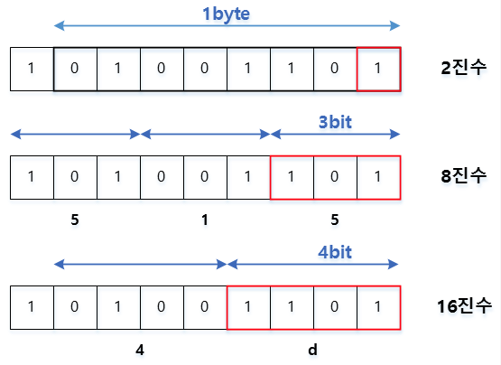

# Data


## 🚸 목차
1. 🌳 [숫자 표현방법](#🌳-숫자-표현방법)
2. 🌳 [문자 표현방법](#🌳-문자-표현방법)


## 🌳 숫자 표현방법
```
컴퓨터는 0과 1로 모드 정보를 표현한다. 그 이상의 수를 어떻게 표현하는지 알기 위해선 컴퓨터가 표현하는 정보단위를 알고, 0과 1로 숫자를 표현하는 방법을 알아야한다.
```

### 🌱 비트 (bit, Binary Digit)
<br>

- 0과 1을 나타내는 가장 작은 정보단위를 `비트`라고 한다. 1비트는 전구 하나를 의미한다.
- 즉, 2비트와 3비트로 표현할 수 있는 정보는 (0,0), (0,1), (1,0), (1,1) 총 4가지다.<br>
=> n개의 비트로 나타낼 수 있는 정보의 수는 2<sup>n</sup>이다.

### 🌱 이진법 (Binary Notation)
우리가 일상적으로 사용하는 십진법을 생각해보면 9 다음 수를 표현할때 자릿수를 올려 10으로 표현하게 된다. 이진법도 동일한 방식으로 작동하며 차이점은 숫자가 1을 넘어가는 시점에 자릿수를 올린다는 것이다.<br>
<br>


### 🌱 이진수 음수표현
- 0과 1만으로 음수를 표현하는 방식 중 가장 널리 사용되는 방식은 `2의 보수`를 구해 음수로 간주하는 방법이다. 
  - 보수 : 더해서 N이 되는 수 (진법에서는 더해서 자리가 바뀌는 수)
  - 2의 보수는 `모든 0과 1을 뒤집고 1을 더한 값`이다.
  - ex. 1011<sub>(2)</sub> ➡️ 0100<sub>(2)</sub> + 1 ➡️ 0101<sub>(2)</sub>

- 위에서 언급된 0101<sub>(2)</sub>이 음수 1011<sub>(2)</sub>`(-11)` 인지 양수 0101<sub>(2)</sub>`(5)` 인지는 어떻게 구분할 수 있을까? <br>
- 이는 CPU의 구성요소인 ALU에서 플래그를 통해 표시하게 된다. 연산 결과 앞에 부호플래그를 사용하여 연산결과를 나타낸다.
  - 부호플래그 : 부호 플래그가 1일 경우 음수, 0일 경우 양수를 의미한다.

### 🌱 십육진법 (Hexadecimal)
<br>
- 이진법만으로 모든 숫자를 표현하기엔 길이가 길어진다는 단점이 있다. 그래서 데이터를 표현할땐 십육진법도 자주 사용하는 방식이다. 표현방식으로는 아래첨자<sub>(16)</sub>를 붙이거나 숫자앞에 `0x` 를 붙여 표기한다.

### 🌱 십육진수와 이진수 변환
<br>
- 십육진수는 한글자당 16개의 글자를 표현할 수 있다. 이를 이진수로 표현하려면 한글자당 4비트가 필요하고 이는 4자리의 2진수로 16진수 한자리를 표현할 수 있다는 의미이다. (2<sup>4</sup> = 16)
- 위 그림에서 4d<sub>(16)</sub>를 한글자씩 끊어 2진수로 표현한 다음 이어붙이면 2진수로 표현된다. 
- (4<sub>(16)</sub> ➡️ 0100<sub>(2)</sub>) + (d<sub>(16)</sub> ➡️ 1101<sub>(2)</sub>) ➡️ 01001101<sub>(2)</sub>

## 🌳 문자 표현방법
```
지금까지 어떻게 컴퓨터가 숫자들을 이해하는지에 대해 공부했다. 그렇다면 문자는 어떻게 이해하는 것일까?
```
### 🌱 문자집합과 인코딩

#### 문자집합
- 컴퓨터가 표현할 수 잇는 문자들의 모음을 의미한다.
- 만일 문자모음이 {a, b, c, d} 로 이뤄져있다면 컴퓨터는 e, f부터 이해하지 못한다.
  
#### 문자 인코딩
- 문자를 0과 1로 변환하는 과정으로 이 과정을 거쳐 컴퓨터가 문자를 이해하게 된다.

#### 문자 디코딩
- 반대로 0과 1로 이뤄진 문자코드를 사람이 이해할 수 있도록 변환하는 과정이다.

```
문자 인코딩 ➡️ 문자 집합 탐색 ➡️ 문자 디코딩
```

### 🌱 아스키 코드
<br>

- 초창기 문자집합중 하나이다.
- 각각의 문자는 7비트로 표현되므로 총 2<sup>7</sup> = 128가지의 문자를 표현할 수 있다.
- 실제로는 8bit(1byte)를 사용하지만 1비트는 오류검출을 위한 페리티비트(parity bit)로 사용되어 실질적으로 사용되는 비트는 7bit이다.
- 예를들어 `A`는 십진수 65 (이진수 1000001<sub>(2)</sub>)로 인코딩된다.
- 그러나 128개보다 더 많은 문자를 표현할 수 없다는 한계가 있다.

### 🌱 EUC-KR
<br>
<br>

- 한글 인코딩의 방식은 완성형과 조합형으로 나뉜다.
- EUC-KR은 대표적인 완성형 인코딩 방식이다.
- 이로써 2,350개 정도의 한글 단어를 표현할 수 있게 되었지만 모든 조합을 표현할만큼의 양은 아니다.
- 그러므로 EUC-KR인코딩을 사용하는 웹사이트는 한글이 깨지는 등의 문제가 발생하기도 한다.

### 🌱 유니코드와 UTF(Unicode Transformation Format)
- EUC 인코딩을 사용한다면 여러 국가의 언어를 지원해야하는 상황에 각 언어별 인코딩 방식을 모두 지원해야하는 불편한 점이 있다. 
- `유니코드`는 대부분 나라의 문자, 특수문자, 이모티콘까지도 코드로 표현할 수 있는 통일된 문자집합니다.
- 현대 문자를 표현할 대 가장 많이 사용되는 표준 문자 집합이다.
- UTF 뒤에 붙는 숫자들은 유니코드 문자에 부여된 값을 인코딩하는 방식에 따라 바뀐다.

#### UTF-8
- 가장 많이 사용되는 방식
- 문자의 코드가 속한 범위에 따라 1 ~ 4byte 사용하는 가변 인코딩방식이다.
- 아스키(ASCII)문자들은 1byte에 그대로 인코딩, 중동와 유럽언어는 2byte, 아시아권은 3byte 이상으로 인코딩한다.
- 웹에서 많이 사용되고 XML및 HTML의 기본 인코딩으로 권장된다.

#### UTF-16
- 2byte(16bit) 가변 길이 인코딩 방식
- 유니코드 한문자를 나타내기 위해 2~4 사용한다. (한글과 영문은 2byte사용)
- UTF-8보다 저장공간의 효율성을 가질수도 있지만 Byte-Ordering을 고려해야 하여 복잡하다.
  - Byte-order : 컴퓨터는 메모리에 정보를 나열하여 저장한다. 이때 Endianness 방식을 사용하여 바이트를 배열하는 방식을 byte-order라고 부른다.
  - Endianness : 1차원 공간에 여러개의 연속된 대상을 배열하는 방법
- JAVA에서 기본으로 사용된다.

#### UTF-32
- 모든 문자를 4byte(32bit) 고정 길이로 인코딩한다.
- 모든 문자에 대한 UTF-32값이 색인화되어있어 인코딩 변환처리가 필요없다.
- 변형규칙 및 가변길이를 고려하지 않아 일관성 있고 단순하다.
- 하나의 문자를 저장하는데 많은 저장공간을 사용한다.