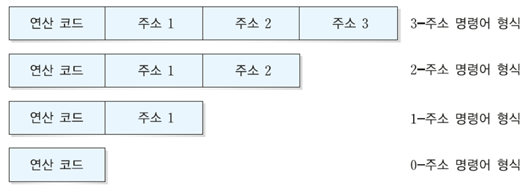
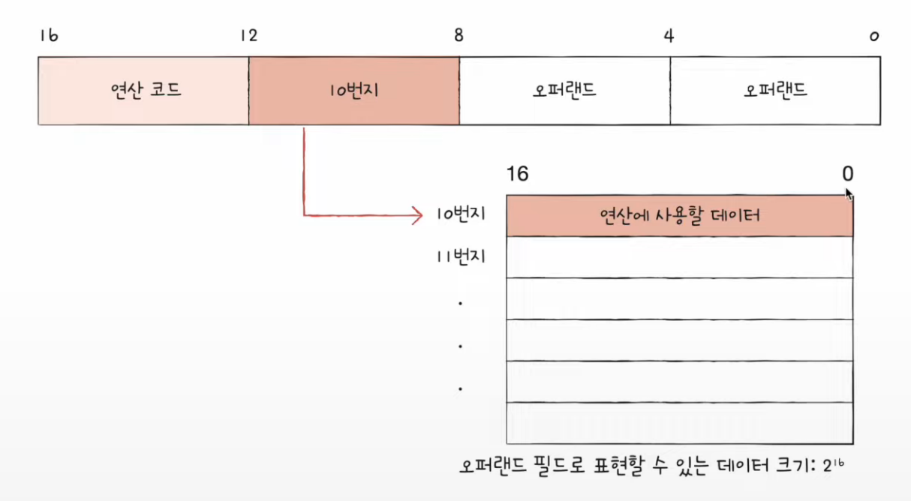
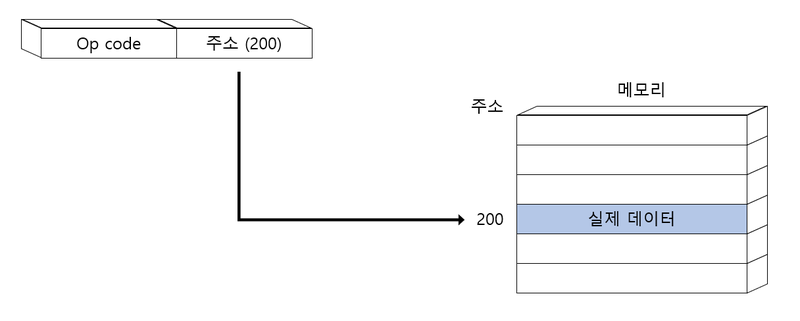
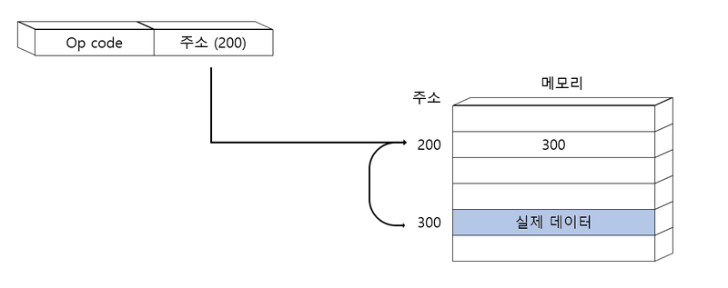
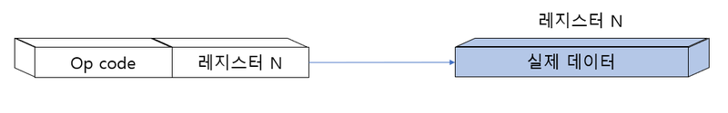
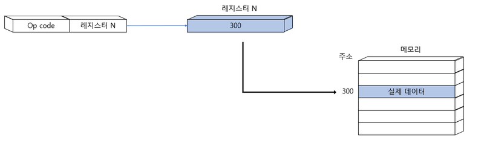

# Command


## 🚸 목차
1. 🌳 [소스 코드와 명령어](#🌳-소스-코드와-명령어)
2. 🌳 [명령어의 구조](#🌳-명령어의-구조)
3. 🌳 [주소 지정방식](#🌳-주소-지정방식)
  

## 🌳 소스 코드와 명령어
```
소스코드는 명령어로 전환된다.
```

### 🌱 고급언어와 저급언어
<br>
- 고급언어 : 사람을 위한 언어
- 저급언어 : 컴퓨터가 직접 이해하고 실행할 수 있는 언어 (명령어로 구성)
  - 기계어 : 0과 1로 이루어진 언어
  - 어셈블리어 : 기계어와 일대일 대응이 되는 컴퓨터 프로그래밍의 저급 언어
  <br> 기계 명령어에 대해 사람이 알아보기 쉬운 니모닉 기호를 정해 적었다.
    > - 10110000 01100001 => `mov al, 061h`<br>
    > - mov는 영어 move를 변형한 니모닉<br>
    > - al은 CPU안에 있는 변수를 저장하는 레지스터의 하나<br>
    > - 061h는 61<sub>(16)</sub>, 97<sub>(10)</sub>, 01100001<sub>(2)</sub> <br>

- 어셈블리어를 작성하거나 관찰일 일이 없는 개발자도 있는 반면 하드웨어와 밀접한 임베디드, 게임, 보안 등의 분야에서는 자주 다루기도 한다.


### 🌱 컴파일 언어
- 컴파일러에 의해 소스코드 전체가 저급언어로 변환되어 실행되는 고급언어이다.
- 컴파일러를 통해 소스 코드 전체를 쭉 훑어보며 소스코드에 문제는 없는지, 실행 가능한지 여부를 파악하며 처음부터 끝까지 저급언어로 컴파일 한다.
- 이 때, 오류가 하나라도 발견된다면 해당 소스코느는 컴파일에 실패
- 이렇게 컴파일러를 통해 저급언어로 변환된 코드를 <b>목적코드</b>라고 한다.
- 대표 : C언어

### 🌱 인터프리터 언어
- 소스코드가 한 줄씩 실행되는 고급언어
- 인터프리터를 통해 소스코드를 한 줄씩 변환하기 때문에 전체를 변환하는 시간을 기다릴 수 없다.
- N번째 줄에 오류가 발생하더라도 N-1번째 줄까지는 올바르게 실행된다.
- 속도 : 컴파일 언어 > 인터프리터 언어
- 대표 : Python

> 컴파일 언어와 인터프리터 언어로 명확하게 구분지을 수 없는 것도 있다. 인터프리터 언어인 python도 컴파일은 진행하고, Java의 경우 저급언어가 되는 과정에서 컴파일과 인터프리터를 동시에 수행한다.

### 🌱 링킹 (Linking)
- 소스코드를 목적코드로 만들어주는 과정이 컴파일이다.
- 링킹은 이렇게 목적코드(저급언어)로 변환된 파일들을 연결시켜 하나의 실행파일로 만들어주는 과정이다.
```java
//add.c
static void add(int a, int b){
    return a+b;
}

//divide.c
static void divide(int a, int b){
    return add(a, b) / b;
}

```
- 위 코드에서 add.c와 divide.c는 컴파일을 통해 소스코드로 변환된다. 그리고 divide.c를 실행하기 위해 add.c를 연결짓는 작업이 링킹이다.


## 🌳 명령어의 구조
```
명령어는 연산코드(명령코드)와 오퍼랜드로 구성되어있다.
```
- 연산코드 : 명령어가 수행할 연산 (연산자)
- 오퍼랜드 : 연산에 사용할 데이터가 저장된 위치 (피연산자)<br>
  ➡️ 위 사진에서 파란글씨가 연산코드, 갈색글시가 오퍼랜드이다.

🌱 오퍼랜드(Operand)

<br>
- 숫자와 문자 등을 나타내는 데이터 또는 연산에 사용할 데이터가 저장된 위치, 즉 메모리 주소나 레지스터 이름이 담기므로 오퍼랜드 필드를 <b>주소필드</b>라고 부르기도 한다.
- 오퍼랜드는 명령어 안에 하나도 없을 수도 있고 한개, 두개, ... 여러개가 있을 수도 있다.
- 여기서 오퍼랜드가 하나도 없는 명령어를 0-주소 명령어라고 한다.
- 1-주소 명령어 ex. ADD X
- 2-주소 명령어 ex. ADD R1, R2
- 3-주소 명령어 ex. ADD R1, R2, R3 

🌱 연산코드
```
연산코드는 크게 4가지로 나뉜다. 아래 내용은 CPU가 공통적으로 이해하는 대표 연산코드의 종류이다.
```
1. 데이터 전송
- MOVE : 데이터를 옮겨라
- STORE : 메모리에 저장하라
- LOAD(FETCH) : 메모리에서 CPU로 데이터를 가져와라
- PUSH : 스택에 데이터를 저장하라
- POP : 스택의 최상단 데이터를 가져와라
1. 산술/논리 연산
- ADD/SUBTRACT/MULTIPLY/DIVIDE : 덧셈/뺄셈/곱셈/나눗셈
- INCREMENT/DECREMENT : 오퍼랜드에 1을 더하라/빼라
- AND/OR/NOT : 논리 연산을 수행하라
- COMPARE: 두 개의 숫자 또는 TRUE/FALSE 값을 비교하라
1. 제어 흐름 변경
- JUMP : 특정 주소로 실행순서를 옮겨라
- CONDITIONAL JUMP : 조건에 부합할 때 특정 주소로 실행 순서를 옮겨라
- HALT : 프로그램의 실행을 멈춰라
- CALL : 되돌아올 주소를 저장할 채 특정 주소로 실행 순서를 옮겨라
- RETURN : CALL을 호출할 때 저장했떤 주소로 돌아가라
1. 입출력 제어
- READ(INPUT) : 특정 입출력 장치로부터 데이터를 읽어라
- WRTIE(OUTPUT) : 특정 입출력 장치로부터 데이터를 써라
- START IO : 입출력 장치를 시작하라
- TEST IO : 입출력 장치의 상태를 확인하라

## 🌳 주소 지정방식
```
  오퍼랜드 필드에 데이터를 담으면 되는건데 왜 주소를 담을까? ➡️ 명령어의 길이 때문이다.
  예를 들어 16비트의 명령어가 있고 그 중 연산코드의 길이가 N이라고 가정했을 때 오퍼랜드 필드에 가장 많은 공간을 할당할 수 있는 1-주소 명령어라고 하더라도 16-N비트의 공간이 할당된다. 2-주소, 3-주소 명령어로 갈 수록 오퍼랜드 필드의 크기는 점점 작아질 것이다.
  하지만 오퍼랜드 필드에 데이터가 아닌 메모리 주소가 담긴다면? 표현할 수 있는 데이터의 크기는 메모리 주소에 저장할 수 있는 공간만큼 커지게 된다.
```
<br>

> 이렇게 오퍼랜드 필드에 데이터가 저장된 위치를 명시할때 연산에 사용할 데이터 위치를 찾는 방법을 <b>주소 지정방식</b>이라고 한다.

🌱 즉시 주소 지정 방식(Immediate Addressing Mode)
<br>
- 연산에 사용할 데이터를 오퍼랜드 필드에 직접 명시하는 방식
- 표현할 수 있는 데이터의 크기가 작아지는 단점이 있지만 데이터를 메모리나 레지스터에서 찾아오는 과정이 없기 때문에 다른 방식들보다 빠르다.
  
🌱 직접 주소 지정 방식(Direct Addressing Mode)
<br>
- 오퍼랜드 필드에 유효주소를 직접 명시하는 방식이다.
- 표현할 수 있는 데이터의 크기는 즉시 주소 지정 방식보다 커졌지만 유효주소의 크기가 연산코드의 비트 수만큼 줄어들어있다.

🌱 간접 주소 지정 방식(Indirect Addressing Mode)
<br>
- 유효주소의 주소를 오퍼랜드 필드에 작성하는 방식이다.
- 짧은 길이로 긴 주소를 접근할 수 있는 장점이 있지만, 기억장치에 두번 이상 접근해야하기 때문에 느린 단점을 가지고 있다.

🌱 레지스터 주소 지정 방식(Register Addressing Mode)
<br>
- 오퍼랜드 필드에 레지스터 번호를 저장하는 방식이다. 
- CPU외부에 있는 메모리에 접근하는 것보다 CPU내부에 있는 레지스터에 접근하는 것이 더 빠르다.
- 그러나 직접 주소 지정 방식과 비슷한 문제를 공유한다.

🌱 레지스터 간접 주소 지정 방식(Register Indirect Addressing Mode)
<br>
- 간접 주소 지정 방식과 레지스터 주소 방식을 혼합하여 만든 방식이다.
- 주소를 찾는 과정은 간접 주소 지정 방식과 비슷하지만 메모리에 접근하는 횟수가 한번으로 줄어는다. ((메모리+메모리) 보다 (레지스터+메모리) 가 더 빠르다.)
