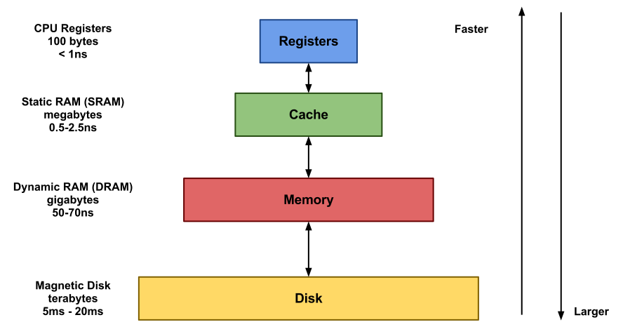
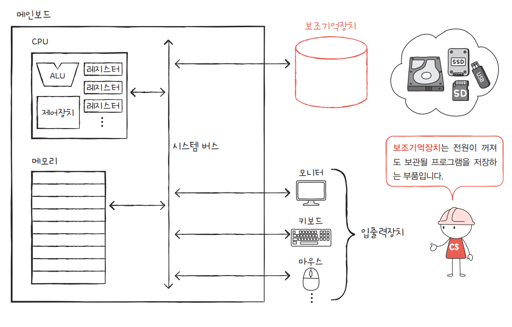

# 보조기억장치

     

메모리는 실행되는 프로그램의 명령어와 데이터를 저장한다고 했지만, 이 메모리는 두 가지 치명적인 약점이 존재함 
1. 가격이 비싸 저장 용량이 적다는 점
2. 전원이 꺼지면 저장된 내용을 잃는다

이에 메모리보다 크기가 크고 전원이 꺼져도 저장된 내용을 잃지 않는 메모리를 보조할 저장 장치가 필요하게 되었는데, 이 저장 장치가 **보조기억장치**

EX) 하드 디스크, SSD, USB 메모리, DVD, CD-ROM과 같은 저장 장치

컴퓨터 전원이 꺼져도 컴퓨터에 파일이 남아 있었던 이유는 우리가 파일을 보조기억장치에 저장했기 때문 

**메모리**가 **현재 ‘실행되는’ 프로그램을 저장**한다면, **보조기억장치**는 **‘보관할’ 프로그램을 저장**

### [장점]
- 주기억장치에 비해 속도는 느리지만 전원이 차단되어도 내용이 그대로 유지
- 저장용량이 큼

     

CPU에서 직접 접근이 불가능하고, 접근하려면 디바이스 드라이버와 시스템 콜을 통하여 기억장치의 특정 위치의 내용을 주기억장치로 로드한 뒤 읽어야 한다.
## 하드 디스크(HDD)
### 대용량 프로그램이나 데이터를 저장하기 위해 사용되는 보조 기억장치
- 보조기억장치 중 접근속도가 가장 빠름
- 자성체를 이용
- 충격에 약함

## SSD
순수 전자식으로 작동하므로 기계식인 하드 디스크의 문제인 긴 탐색 시간, 반응 시간, 기계적 지연, 실패율, 소음을 크게 줄여 준다.

## 오프라인 저장장치
### 필요시 연결해 사용하는 저장장치
- 속도가 하드디스크에 비해 상대적으로 느림
- 정보를 쉽게 저장하고 이동하기 편리
- EX) CD-ROM, DVD, SD 메모리, 테이프 레코더 등
  - CD-ROM : 650MB의 광디스크로 단면사용, 직경 12Cm, 멀티미디어의 표준매체로 읽기만 가능
  - DVD : 디지털 비디오 디스크로 4.7-17GB기록 , 양면사용(CD-ROM 포함), 직경 12Cm 

## 📖 참고 자료
[[컴퓨터 구조] 컴퓨터의 4가지 핵심 부품: CPU, 메모리, 보조기억장치, 입출력장치](https://hongong.hanbit.co.kr/%EC%BB%B4%ED%93%A8%ED%84%B0%EC%9D%98-4%EA%B0%80%EC%A7%80-%ED%95%B5%EC%8B%AC-%EB%B6%80%ED%92%88cpu-%EB%A9%94%EB%AA%A8%EB%A6%AC-%EB%B3%B4%EC%A1%B0%EA%B8%B0%EC%96%B5%EC%9E%A5/)  
[[컴퓨터의 기억창치]](https://optimal-soup.tistory.com/46)
