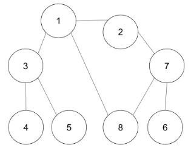

# DFS && BFS

### ✏️  DFS (Depth First Search, 깊이 우선 탐색)


- 루트노드에서 한 방향으로 계속 나아가다가 더 이상 나아갈 수 없는 리프노드를 마주했을때 마지막에 마주했던 노드로 돌아와 갈 수 있는 다르 방향의 노드가 있는지 확인 후 다른 방향의 노드로 탐색을 계속해 나간다.
- Stack을 사용해 구현한다.
  
#### ✅ 작동방식
 1. 탐색 시작 노드를 스택에 삽입하고, 방문 처리한다.

 2. 스택의 최상단 노드에 방문하지 않은 인접 노드가 있으면 그 인접 노드를 스택에 넣고 방문 처리하고,

     방문하지 않은 인접 노드가 없으면 스택에서 최상단 노드를 꺼낸다.

 3. 위의 1번과 2번 과정을 더 이상 수행할 수 없을 때까지 반복한다.
  
#### ✅ 시간복잡도 (V : 접점 / E : 간선)
- 인접행렬 : O(V<sup>2</sup>)
- 인접리스트 : O(V + E)


> 재귀함수를 통한 DFS구현
### 


``` java
public class DFSExamRecursion {
    //각 노드가 방문된 정보를 1차원 배열 자료형으로 표현
    public static boolean [] visited = new boolean[9];
    // 각 노드가 연결된 정보를 2차원 배열 자료형으로 표현
    // 각 인덱스에 연결된 인덱스들을 표현
    public static int[][] graph = {{},
        {2, 3, 8},
        {1, 7},
        {1, 4, 5},
        {3, 5},
        {3, 4},
        {7},
        {2, 6, 8},
        {1, 7}};
    
    public static void main(String[] args){
        dfs(1); // 시작 노드 1
    }
    

	// dfs 알고리즘을 수행하는 함수
	// 재귀함수는 자료구조상 스택으로 구현된다.
   
    public static void dfs(int v){
        // 현재 노드 방문 처리
        visited[v] = true;
        // 방문 노드 출력
        System.out.print(v + "");
        
        // 인접 노드 탐색
        for (int i : graph[v]){
            // 방문하지 않은 인접 노드 중 가장 작은 노드를 스택에 넣기
            if (visited[i]==false){
                dfs(i);
            }
        }
    }
}

// 출력결과 : 1 2 7 6 8 3 4 5


```
---
### ✏️  BFS (Breadth First Search, 너비 우선 탐색)


- 루트 노드 또는 임의의 노드에서 인접한 노드부터 탐색하는 방법
- 선입선출의 Queue를 사용한다.
  - 인접한 노드를 반복적으로 큐에 넣도록 알고리즘을 작성하면 자연스럽게 먼저 들어온 것이 먼저 나가며, 가까운 노드부터 탐색하게 된다.
  
#### ✅ 작동방식
1. 탐색 시작 노드를 큐에 삽입하고 방문 처리한다.

2. 큐에서 노드를 꺼내 해당 노드의 인접 노드 중에서 방문하지 않은 노드를 모두 큐에 삽입하고 방문 처리한다.

3. 위의 1번과 2번 과정을 더 이상 수행할 수 없을 때까지 반복한다.
  
#### ✅ 시간복잡도 (V : 접점 / E : 간선)
- 인접행렬 : O(V<sup>2</sup>)
- 인접리스트 : O(V + E)

> Queue를 활용한 BFS구현

``` java
import java.util.LinkedList;
import java.util.Queue;

public class BFS {
    public static void main(String[] args){
        //각 노드가 연결된 정보를 2차원 배열 자료형으로 표현
        int [][]graph = {{},
            {2, 3, 8},
            {1, 7},
            {1, 4, 5},
            {3, 5},
            {3, 4},
            {7},
            {2, 6, 8},
            {1, 7}};
        
        //각 노드가 방문된 정보를 1차원 배열 자료형으로 표현
        public static boolean [] visited = new boolean[9];
        
        int start = 1; // 시작 노드
        // 큐 구현
        Queue<Integer> queue = new LinkedList<>();
            queue.add(start);
            
            // 현재 노드를 방문 처리
            visited[start] = true;
            
            // 큐가 빌때까지 반복
            while(!queue.isEmpty()){
                // 큐에서 하나의 원소를 뽑아 출력
                int v = queue.poll();
                System.out.println(v + " ");
                
                // 인접한 노드 중 아직 방문하지 않은 원소들을 큐에 삽입
                for (int i : graph[v]){
                    if (visited[i] == false){
                        queue.add(i);
                        visited[i] = true;
                    }
                }
            }
        }
    }
    // 출력결과 : 1 2 3 8 7 4 5 6

```

### ✏️ 최종 정리
<table>
<tr>
    <th></th>
    <th style="text-align:center;">DFS</th>
    <th style="text-align:center;">BFS</th>
<tr>
    <td style="text-align:center;">동작 원리</td>
    <td style="text-align:center;">Stack</td>
    <td style="text-align:center;">Queue</td>
<tr>
    <td style="text-align:center;">구현 방법</td>
    <td style="text-align:center;">재귀함수 또는 스택 자료구조 이용</td>
    <td style="text-align:center;">큐 자료구조 이용</td>
</table>

---
### ✏️ 관련 문제 예시 및 풀이

#### BAEKJOON - [Silver II] DFS와 BFS - 1260 
[문제 링크](https://www.acmicpc.net/problem/1260) 

``` java
import java.io.BufferedReader;
import java.io.IOException;
import java.io.InputStreamReader;
import java.util.LinkedList;
import java.util.Queue;
import java.util.StringTokenizer;

public class Main {
    static StringBuilder sb = new StringBuilder();
    static boolean[] check; // 한번 체크한 숫자인지 아닌지 확인하기 위한 boolean 배열
    static int node;
    static int[][] arr;

    public static void main(String[] args) throws IOException {
        BufferedReader br = new BufferedReader(new InputStreamReader(System.in));
        StringTokenizer st = new StringTokenizer(br.readLine());

        node = Integer.parseInt(st.nextToken());
        int line = Integer.parseInt(st.nextToken());
        int rootNode = Integer.parseInt(st.nextToken());
        check = new boolean[node+1];

        arr = new int[node+1][node+1];
        for (int i = 0; i < line; i++) {
            st = new StringTokenizer(br.readLine());
            int a = Integer.parseInt(st.nextToken());
            int b = Integer.parseInt(st.nextToken());
            arr[a][b] = arr[b][a] = 1; // 인접 행렬 생성 (노드들간의 간선이 존재한다는 것을 의미)
        }

        dfs(rootNode);
        sb.append("\n");
        check = new boolean[node+1]; // dfs -> bfs 넘어가면서 check배열 초기화.
        bfs(rootNode);

        System.out.println(sb);
    }

    // dfs(깊이 우선 탐색) 구현
    public static void dfs(int rootNode) {
        check[rootNode] = true;
        sb.append(rootNode).append(" ");

        for (int i = 1; i <= node; i++) { // 모든 노드의 수만큼 반복 진행
            if(arr[rootNode][i] == 1 && !check[i]) // 그 숫자가 다른 숫자들과 간선이 있는지 && 그 숫자를 체크했던 적이 있는지 확인
                dfs(i);  // 모든 조건을 만족한다면 해당 숫자로 재귀 시작
        }
    }

    // bfs(넓이 우선 탐색) 구현
    public static void bfs(int rootNode){
        Queue<Integer> queue = new LinkedList<>(); // bfs를 위한 큐 생성 (FIFO)
        queue.add(rootNode);
        check[rootNode] = true;

        while (!queue.isEmpty()) { // 큐가 다 빌때까지 진행
            int number = queue.poll(); // 가장 먼저 들어간 숫자 꺼내서
            sb.append(number).append(" ");
            for (int i = 1; i <= node; i++) { // 모든 노드의 수만큼 반복 진행
                if (arr[number][i] == 1 && !check[i]) { // 그 숫자가 다른 숫자들과 간선이 있는지 && 그 숫자를 체크했던 적이 있는지 확인
                    queue.add(i);  // 모든 조건을 만족하며 큐에 해당 숫자 입력
                    check[i] = true;
                }
            }
        }
    }
}
```