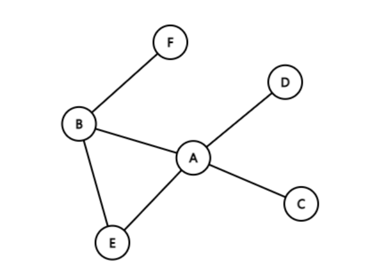
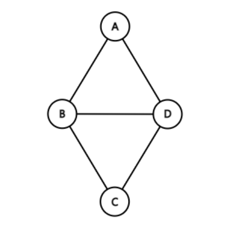
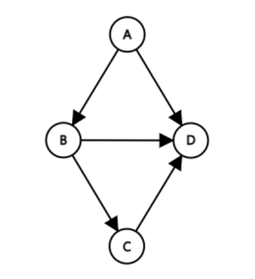
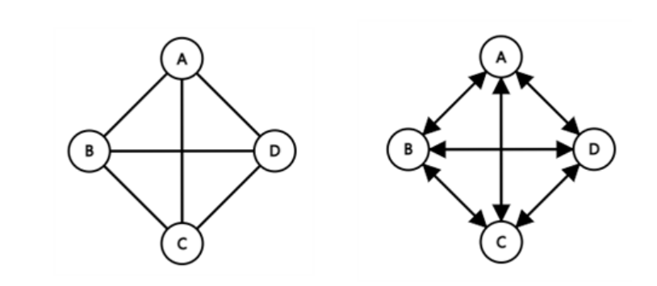
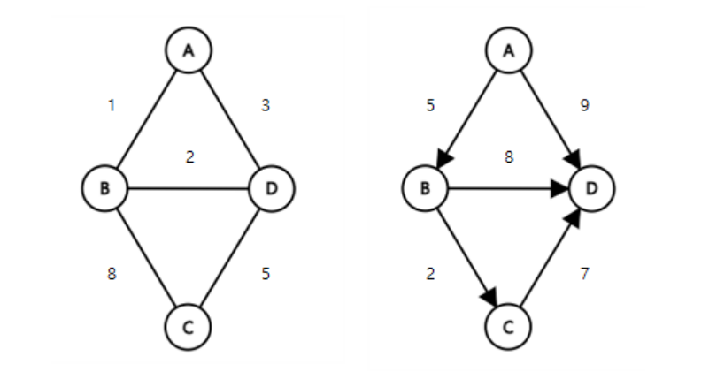
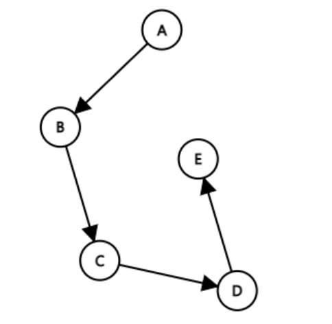
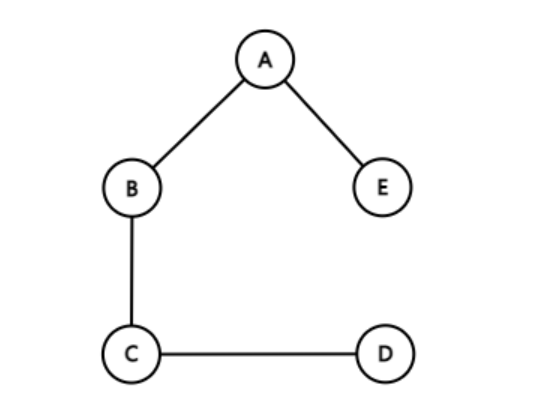
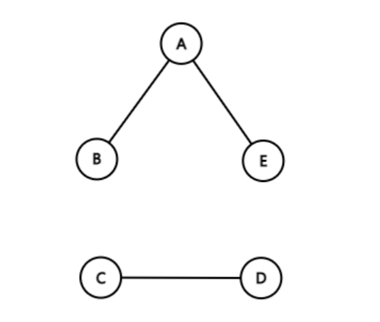
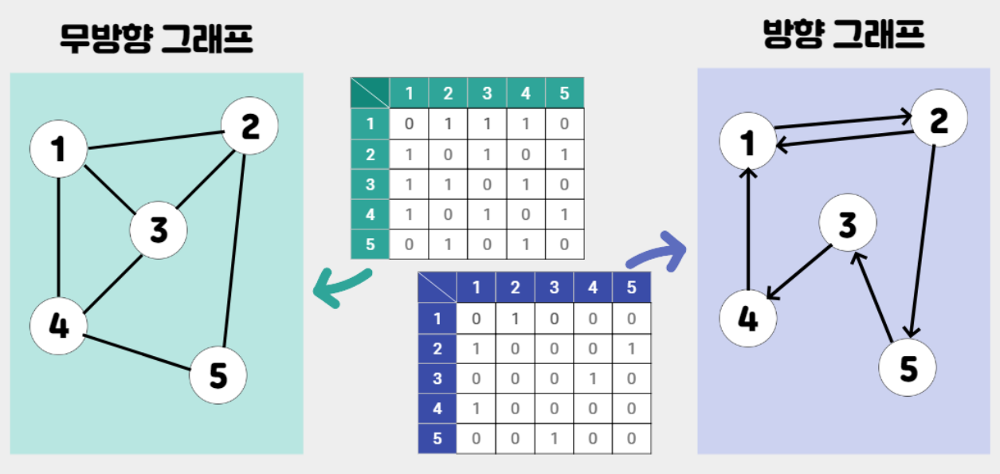

# 그래프(Graph)
### 연결되어 있는 원소 간의 관계를 표현한 자료구조

<div align='center'>
    
    <p>그래프</p>
</div>

- 그래프는 연결할 객체를 나타내는 정점(Vertex)과 객체를 연결하는 간선(Edge)의 집합으로 구성됨
- 그래프 G를 G=(V,E)로 정의하는데 V는 정점의 집합, E는 간선들의 집합을 의미

<br>

# 그래프의 종류
## 무방향 그래프(Undirected Graph)
### 두 정점을 연결하는 간선에 방향이 없는 그래프

<div align='center'>
    
    <p>무방향 그래프</p>
</div>

- 무방향 그래프에서 정점 V<sub>i</sub>와 V<sub>j</sub>를 연결하는 간선을 (V<sub>i</sub>,V<sub>j</sub>)로 표현하는데 (V<sub>i</sub>,V<sub>j</sub>)와 (V<sub>j</sub>,V<sub>i</sub>)는 같은 간선을 나타냄
- V(G1)={A,B,C,D}, E(G1)={(A,B), (A,D), (B,C), (B,D), (C,D)}

<br>

## 방향 그래프(Directed Graph)
### 두 정점을 연결하는 간선에 방향이 없는 그래프

<div align='center'>
    
    <p>방향 그래프</p>
</div>

- 방향 그래프에서 정점 Vi와 Vj를 연결하는 간선을 <V<sub>i</sub>,V<sub>j</sub>>로 표현하는데 V<sub>i</sub>를 꼬리(tail), V<sub>j</sub>를 머리(head)라고 합니다. 이때 <V<sub>i</sub>,V<sub>j</sub>>와 <V<sub>j</sub>,V<sub>i</sub>>는 서로 다른 간선
- V(G1)={A,B,C,D} E(G1)={<A,B>, <A,D>, <B,C>, <B,D>, <C,D>}

<br>

## 완전 그래프(Complete Graph)
### 한 정점에서 다른 모든 정점과 연결되어 최대 간선 수를 갖는 그래프

<div align='center'>
    
    <p>완전 그래프</p>
</div>

- 정점이 n개인 완전 그래프에서 무방향 그래프의 최대 간선 수는 n(n-1)/2이고 방향그래프의 최대 간선 수는 n(n-1)

<br>

## 가중 그래프(Weight Graph)
### 정점을 연결하는 간선에 가중치(weight)를 할당한 그래프

<div align='center'>
    
    <p>가중 그래프</p>
</div>

<br>

## 유향 비순환 그래프(DAG, Directed Acyclic Graph)
### 방향 그래프에서 사이클이 없는 그래프

<div align='center'>
    
    <p>유향 비순환 그래프</p>
</div>

<br>

## 연결 그래프(Connected Graph)
### 떨어져 있는 정점이 없는 그래프

<div align='center'>
    
    <p>연결 그래프</p>
</div>

<br>

## 단절 그래프(Disconnected Graph)
### 연결되지 않은 정점이 있는 그래프

<div align='center'>
    
    <p>단절 그래프</p>
</div>

<br>

# 그래프의 용어
### 그래프에서 두 점  V<sub>i</sub>와 V<sub>j</sub>가 연결되어 간선 (V<sub>i</sub>,V<sub>j</sub>)가 있을 때, 두 정점 V<sub>i</sub>와 V<sub>j</sub>를 인접(adjacent)한다 하고, 간선 (V<sub>i</sub>,V<sub>j</sub>)는 정점 V<sub>i</sub>와 V<sub>j</sub>에 부속(incident)되어 있다고 함

### 차수(Degree) : 정점에 부속되어 있는 간선의 수
- 진입차수(in-degree) : 정점을 머리로 하는 간선의 수
- 진출차수(out-degree) : 정점을 꼬리로 하는 간선의 수

### 경로(Path) : 정점 V<sub>i</sub>에서 V<sub>j</sub>까지 간선으로 연결된 정점을 순서대로 나열한 리스트
- 단순 경로(Simple path) : 모두 다른 정점으로 구성된 경로

### 경로 길이(Path Length) : 경로를 구성하는 간선의 수

### 사이클(Cycle) : 단순 경로 중에서 경로의 시작 정점과 마지막 정점이 같은 경로

<br>

## 그래프 구현 방법
### 인접 행렬
#### 이차원 배열을 이용하는 방식

<div align='center'>
    
</div>

- **구현하기 쉽다**는 장점이 있지만, **인접리스트보다 느리다**는 단점이 있다.
- 노드 개수의 제곱에 해당하는 공간을 차지, O(n<sup>2</sup>)
- 간선이 많은 그래프의 경우, 인접 행렬을 통해 빠르게 연결 여부를 확인할 수 있음
```
public class Main {
 
    public static void print(int[][] graph) {
        for (int i = 1; i < graph.length; i++) {
            for (int j = 1; j < graph.length; j++)
                System.out.print(graph[i][j]+ " ");
            System.out.println();
        }
    }
 
    public static void putEdge(int[][] graph, int x, int y) {
        graph[x][y] = 1;
        graph[y][x] = 1;
    }
 
    public static void main(String[] args) {
        int n = 5; //그래프 정점의 개수
        int[][] graph = new int[n+1][n+1]; //index를 1부터 맞추기 위해 n+1
 
        putEdge(graph, 1, 2);
        putEdge(graph, 1, 3);
        putEdge(graph, 1, 4);
        putEdge(graph, 2, 3);
        putEdge(graph, 2, 5);
        putEdge(graph, 3, 4);
        putEdge(graph, 4, 5);
 
        print(graph);
 
    }
}
```

### 인접 리스트
#### 연결리스트를 이용하는 방식

<div align='center'>
    
</div>

- 각각의 정점에 대하여 인접한 번호를 저장
- **인접행렬보다 빠르다**는 장점이 있지만, **인접행렬보다 구하기 어렵다**는 단점이 있다.
- 연결된 간선만의 정보를 저장해서 간선의 개수만큼 공간을 차지한다, O(n)
- 간선이 적은 그래프의 경우는 인접 리스트를 통해 인접 노드를 빠르게 확인할 수 있음
```
public class Main {
 
    public static void print(ArrayList<ArrayList<Integer>> graph) {
        for (int i = 1; i < graph.size(); i++) {
            ArrayList<Integer> node = graph.get(i);
            System.out.print("node"+"["+i+"] : ");
            for (int j = 0; j < node.size(); j++)
                System.out.print(node.get(j)+ "->");
            System.out.println();
        }
    }
 
    public static void putEdge(ArrayList<ArrayList<Integer>> graph, int x, int y) {
        graph.get(x).add(y);
        graph.get(y).add(x);
    }
 
    public static void main(String[] args) {
        int n = 5; //그래프 정점의 개수
        ArrayList<ArrayList<Integer>> graph = new ArrayList<>();
 
        for (int i = 0; i <= n; i++)
            graph.add(new ArrayList<>()); //각 노드 별 리스트를 만들어준다.
        putEdge(graph, 1, 2);
        putEdge(graph, 1, 3);
        putEdge(graph, 1, 4);
        putEdge(graph, 2, 3);
        putEdge(graph, 2, 5);
        putEdge(graph, 3, 4);
        putEdge(graph, 4, 5);
 
        print(graph);
 
    }
}
```

## 📖 참고 자료
[[자료구조] 그래프(Graph)의 개념 설명](https://leejinseop.tistory.com/43) 

[[JAVA] 그래프 구현하기 (인접행렬, 인접리스트)](https://born2bedeveloper.tistory.com/42)

