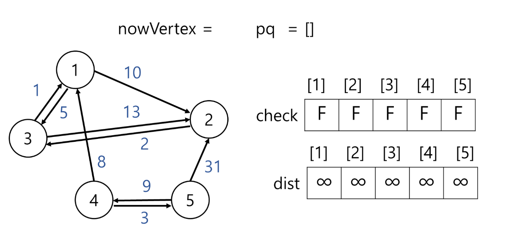
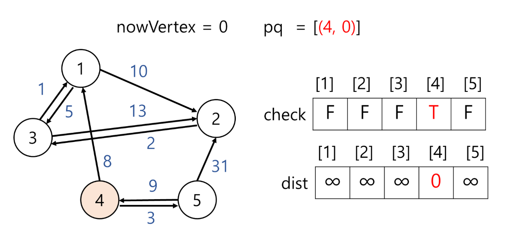
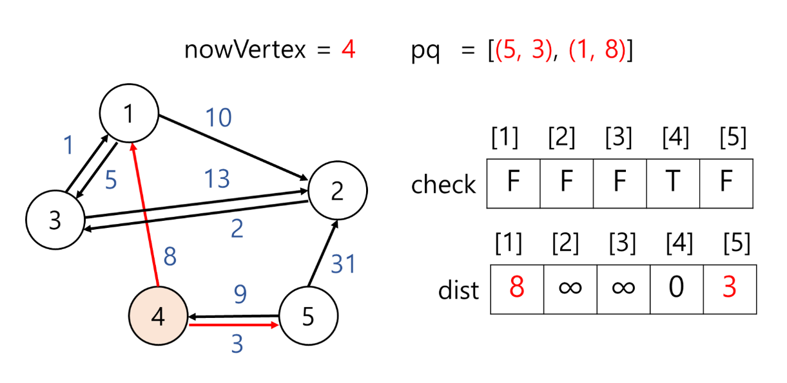
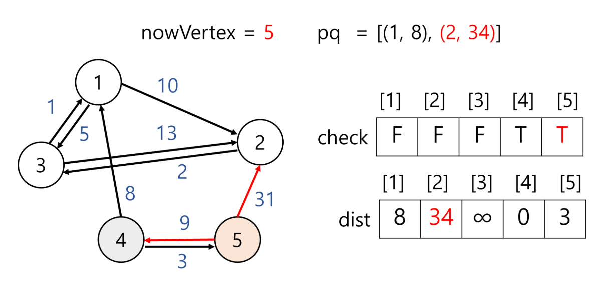
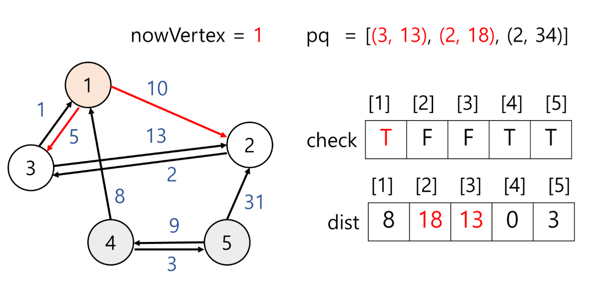
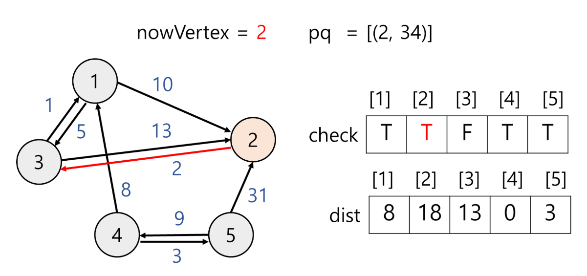
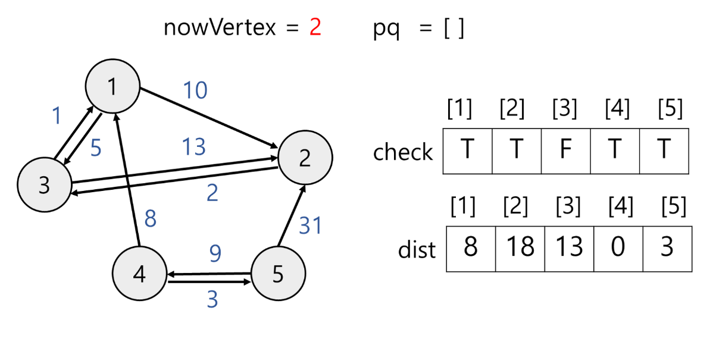
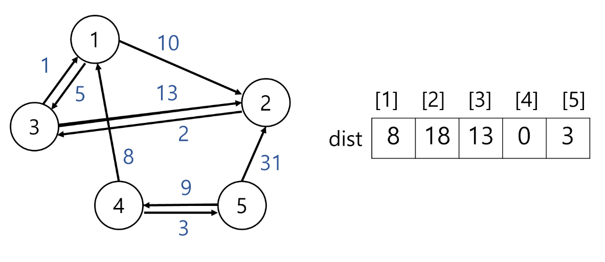

# 🔎 다익스트라 알고리즘이란?

### 그래프 최단 거리 구하는 알고리즘
1. 다익스트라(Dijkstra)
2. 벨만-포드(Bellman-Frod)
3. 플로이드-와샬(Floyd-Wrasahll)

## 다익스트라(Dijkstra) 알고리즘

<div align='center'>
	
</div>

<br>

- 그래프의 최단 경로 구하는 알고리즘
- 하나의 정점에서 출발하는 최단 거리를 구함(출발지만 정함)
- 음수 가중치 없어야 함
- 인접 행렬로 표현된 그래프의 경우 시간 복잡도 O(n<sup>2</sup>)
- 우선순위 큐 사용하여 시간 복잡도 O(mlog n)까지 낮출 수 있음 → 개선된 다익스트라 알고리즘
- 탐욕법과 동적 계획법 사용

최단 거리 구하는 알고리즘에서 출발지 하나를 고르는 것은 벨만-포드와 같다. 다익스트라와 벨만-포드의 차이점은 아래와 같다.

||다익스트라|벨만-포드|
|:---:|:---:|:---:|
|음수 가중치|X|O|
|음수 사이클|X|X|
|시간 복잡도|O(mlog n)|O(mn)|

<br>

# 🔎 다익스트라 알고리즘 과정

### 1) 아직 방문하지 않은 정점 중 출발지로 부터 가장 거리가 짧은 정점을 방문한다.
### 2) 해당 정점을 거쳐 갈 수 있는 정점의 거리가 이전 기록한 값보다 적으면 갱신한다.

### 예시)

`pq`는 우선순위 큐로 정점과 출발지에서 정점까지 가는 최소 거리를 저장한다. 우선순위는 거리가 짧을수록 높다.
`check`는 boolean 배열로 해당 정점을 방문하는지 체크한다.
`dist`는 int 배열로 출발지에서 최소 거리를 기록한다.

<div align='center'>
    
</div>


#### 1) 출발지 4를 우선순위 큐에 넣는다. 출발지이므로 거리는 0이다.

<div align='center'>
    
</div>

#### 2) 우선순위 큐에서 하나 꺼내 `nowVertex`에 저장하고 방문체크를 한다. `nowVertex`을 거쳐 갈 수 있는 정점의 거리가 이전 기록한 값보다 적으면 갱신한다.

<div align='center'>
    
</div>


`nowVertex`는 4이다. 정점 4와 인접한 정점은 1과 5가 있다.

- `dist[1]` = 8로 변경
  
  처음 정점은 출발지이다. 출발지에서 정점 1로 가는 거리는 8이므로 `dist[1]` 값을 갱신해준다. 우선순위 큐에 정점 1과 출발지에서 정점 1까지 가는 거리(=8)을 추가해준다.(1, 8)

- `dist[5]` = 3로 변경
  
  위와 동일한 이유로 값을 갱신하고 우선순위 큐에 값을 추가한다.(5, 3)


#### 3) 우선순위 큐에 값이 있으므로 하나 꺼내 `nowVertex`에 저장하고 방문 처리한다.

<div align='center'>
    
</div>

`nowVertex` = 5이고 방문하지 않았으므로 방문 체크 후 인접 정점 살펴본다. 정점 5과 인접한 정점은 4와 2가 있다.

- `dist[2]` = 34로 값 변경
  
  출발지에서 정점 2로 가는 값을 살펴준다. 이 때 경우는 2가지이다.
  
  ① 지금까지 계산한 출발지 ~ 정점 2 최단 거리 = `dist[2]`
  
  ② 출발지에서 정점 5를 지나서 정점 2를 가는 거리 = `dist[5]` + 정점 5에서 정점 2로 가는 거리(=간선의 가중치)
  
  ①과 ②를 비교하여 더 작은 값을 `dist[2]`에 기록한다.
  
  ①과 ② 를 계산해보자.
  
  ① `dist[2]` = 무한
  
  ② `dist[5]` + 정점 5에서 정점 2로 가는 거리 = 3 + 31 = 34
  
  ① > ② 이므로 값을 갱신하고 우선순위 큐에 해당 정점을 추가한다.(2, 34)

- `dist[4]` 값 변경 x
  
  ① `dist[4]` = 0이다.
  
  ② `dist[5]` + 정점 5에서 정점 4로 가는 거리 = 3+ 9 = 12이다.
  
  ① < ② 이므로 값 갱신하지 않는다.


#### 4) 우선순위 큐에서 값을 꺼낸다.

<div align='center'>
    
</div>

`nowVertex` = 1이고 방문하지 않았으므로 방문 체크 후 인접 정점 살펴본다. 정점 1과 인접한 정점은 2와 3이 있다.

- `dist[2]` = 18로 값 변경
 
  ① `dist[2]` = 34
  
  ② `dist[1]` + 정점 1에서 정점 2로 가는 거리 = 8 + 10 = 18
  
  ① > ② 이므로 값을 갱신하고 우선순위 큐에 해당 정점을 추가한다.(2, 18)

- `dist[3]` = 13로 값 변경

  ① `dist[3]` = 무한
  
  ② `dist[1]` + 정점 1에서 정점 3로 가는 거리 = 8 + 5 = 13
  
  ① > ② 이므로 값을 갱신하고 우선순위 큐에 해당 정점을 추가한다.(3, 13)


#### 5) 우선순위 큐에서 값을 꺼낸다.

<div align='center'>
    
</div>

`nowVertex` = 3이고 방문하지 않았으므로 방문 체크 후 인접 정점 살펴본다. 정점 3과 인접한 정점은 1과 5가 있다.

- `dist[1]` 값 변경x

  ① `dist[1]` = 8

  ② `dist[3]` + 정점 3에서 정점 1로 가는 거리 = 13 + 1 = 14

  ① < ② 이므로 값을 갱신하지 않는다.

- `dist[2]` 값 변경x

  ① `dist[2]` = 18

  ② `dist[3]`+ 정점 3에서 정점 2로 가는 거리 = 13 + 13 = 26

  ① < ② 이므로 값을 갱신하지 않는다.


#### 6) 우선순위 큐에서 값을 꺼낸다.

<div align='center'>
    
</div>

`nowVertex` = 2이고 방문하지 않았으므로 방문 체크 후 인접 정점 살펴본다. 정점 2과 인접한 정점은 3이다.

- `dist[3]` 값 변경x
 
  ① `dist[3]` = 13

  ② `dist[2]` + 정점 2에서 정점 3로 가는 거리 = 18 + 2 = 20

  ① < ② 이므로 값을 갱신하지 않는다.


#### 7) 우선순위 큐에서 값을 꺼낸다.

<div align='center'>
    
</div>

`nowVertex` = 2이고 방문했으므로 다음으로 넘어간다.


8) 우선순위 큐가 비었으므로 다익스트라 알고리즘을 종료한다. 정점 4에서 출발하여 다른 정점까지 최소 거리는 다음 `dist` 배열과 같다.

<div align='center'>
    
</div>

<br>

# 💻 다익스트라 알고리즘 구현 - Java
> 개선된 다익스트라 알고리즘 구현을 위해 인접 리스트 그래프 + 우선순위 큐를 사용하였다.

### `Node` 클래스를 만든다. 이 클래스는 우선순위 큐에 정점번호 + 가중치 저장을 위해 만드는 것이다.

```
class Node implements Comparable<Node>{
	int index;
	int cost;
	
    //정점번호, 가중치 저장
	public Node(int index, int cost) {
		this.index = index;
		this.cost = cost;
	}

	//cost(=가중치)  중심으로 우선순위가 정해지기 때문에 compareTo 오버라이딩
    //다른 방법으로 이를 생략하고 우선순위 큐 아래처럼 선언
    /**PriorityQueue<Node> pq = new PriorityQueue<Node>
    	((o1, o2) -> Integer.compare(o1.cost, o2.cost));
    **/
	@Override
	public int compareTo(Node o) {
		return Integer.compare(this.cost, o.cost);
	}
}
```

### `boolean check` 배열과 `int dist` 배열을 만든다.
`check` 배열은 정점을 방문했는지 확인하고, `dist` 배열은 출발지로부터 거리가 얼마나 되는지 기록한다. `dist` 배열은 INF(무한대) 값으로 초기화한다.

```
boolean[] check = new boolean[n + 1];
int[] dist = new int[n + 1];

int INF = Integer.MAX_VALUE;
Arrays.fill(dist, INF);
```

### 출발지는 방문으로 표시하고 `dist`배열 해당 인덱스에 0으로 기록한다. 출발지 정점과 가중치를 우선순위 큐에 넣는다. 이때 우선순위는 가중치가 가장 작은 것이다.

```
dist[start] = 0;
PriorityQueue<Node> pq = new PriorityQueue<>();
pq.offer(new Node(start, 0));
```

### 큐가 빌 때 까지 다음을 반복한다.

#### 1) 큐 앞에 있는 값을 가져오고 삭제한다. 이를 `nowVertex`로 하겠다. 이때 가져온 값은 현재 큐에 있는 값 중 출발지로부터 가장 가까운 거리(=작은 가중치)를 가졌다.
```
int nowVertex = pq.poll().index;
```

#### 2-1) 만약 `nowVertex`를 방문했다면 다시 1)로 돌아간다.

#### 2-2) 만약 `nowVertex`를 방문하지 않았다면 방문 처리 후 3)을 수행한다.

#### 3) `nowVertex`과 인접한 정점들을 살핀다. 이때 하나의 인접정점을 `next`로 하겠다.

① 지금까지 출발지에서 `next`로 갈 때 가장 빠른 거리

② 출발지에서 `nowVertex` 방문 후 next로 가는 거리

① < ② 라면 지금까지 계산한 출발지-next 거리보다 출발지-`nowVertex`-`next` 거리가 더 짧다는 뜻이므로 값을 갱신하고 next 정점과 ②값을 우선순위 큐에 넣어준다.

(출발지에서 갈 수 있는 정점이면 우선순위 큐에 넣어서 최단 거리를 계산해줘야 한다.)
```
//index의 연결된 정점 비교
for(Node next : graph[nowVertex]) {
	if(dist[next.index] > dist[nowVertex]+ next.cost) {
		dist[next.index] = dist[nowVertex] + next.cost; //값 갱신
		pq.offer(new Node(next.index, dist[next.index]));
	}
}
```
### 전체코드
```
class Node implements Comparable<Node>{
	int index;
	int cost;
	
	public Node(int index, int cost) {
		this.index = index;
		this.cost = cost;
	}

	@Override
	public int compareTo(Node o) {
		return Integer.compare(this.cost, o.cost);
	}
}

public class Main {
	static ArrayList<Node>[] graph;
	
    //노드의 크기, 출발지
	public static void Dijkstra(int n, int start) {
		boolean[] check = new boolean[n + 1];
		int[] dist = new int[n + 1];
		int INF = Integer.MAX_VALUE;
		
		Arrays.fill(dist, INF);
		dist[start] = 0;
		
		PriorityQueue<Node> pq = new PriorityQueue<>();
		pq.offer(new Node(start, 0));
		
		while(!pq.isEmpty()) {
			int nowVertex = pq.poll().index;
			
			if(check[nowVertex]) continue;
			check[nowVertex] = true;
			
			//index의 연결된 정점 비교
			for(Node next : graph[nowVertex]) {
				if(dist[next.index] > dist[nowVertex]+ next.cost) {
					dist[next.index] = dist[nowVertex] + next.cost;
					
					pq.offer(new Node(next.index, dist[next.index]));
				}
			}
		}
        
        //최소거리 출력
		for(int i : dist) {
			if(i == INF) System.out.print(0 + " ");
			else System.out.print(i+" ");
		}
	}

	public static void main(String[] args) throws IOException {
    
    //그래프 입력 받기
		BufferedReader bf = new BufferedReader(new InputStreamReader(System.in));
		//정점의 개수, 간선의 개수
		int n = Integer.parseInt(bf.readLine());
		int m = Integer.parseInt(bf.readLine());
		
		graph = new ArrayList[n+1];
		for (int i = 0; i <= n; i++)  graph[i] = new ArrayList<>();
		
		StringTokenizer st;
		for(int i = 0 ; i < m; i++) {
			st = new StringTokenizer(bf.readLine());
			int v = Integer.parseInt(st.nextToken());
			int w = Integer.parseInt(st.nextToken());
			int cost = Integer.parseInt(st.nextToken());
			
			graph[v].add(new Node(w, cost));
		}

		int start = Integer.parseInt(bf.readLine());

		//다익스트라 알고리즘 수행
		Dijkstra(n, start);
		
	}
}
입력
5
9
1 2 10
1 3 5
2 3 2
3 1 1
3 2 13
4 1 8
4 5 3
5 4 9
5 2 31
4 3

출력 결과
0 8 18 13 0 3 //인덱스 0은 사용 x 
```

## 📖 참고 자료
[다익스트라 알고리즘이란?](https://velog.io/@suk13574/%EC%95%8C%EA%B3%A0%EB%A6%AC%EC%A6%98Java%EB%8B%A4%EC%9D%B5%EC%8A%A4%ED%8A%B8%EB%9D%BCDijkstra-%EC%95%8C%EA%B3%A0%EB%A6%AC%EC%A6%98)