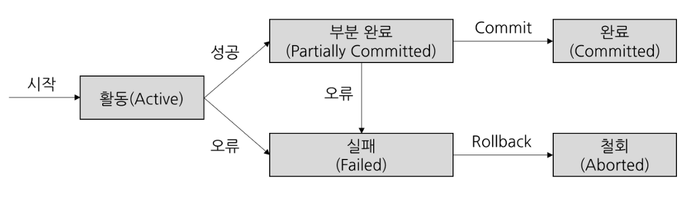
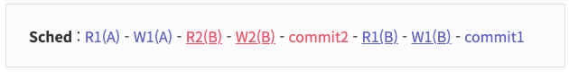
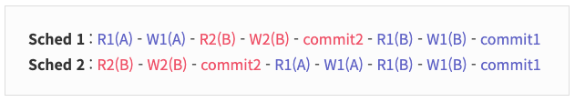

## 🚸 목차
1. 🌳 트랜잭션이란?
2. 🌳 ACID
3. 🌳 Concurrency Control

<hr>

# 🌳 트랜잭션(Transaction) 이란?
```
데이터베이스의 상태를 변환시키는 하나의 논리적 기능을 수행하기 위한 작업의 단위 또는 한꺼번에 모두 수행되어야 할 연산들
```
- 작업의 정합성을 보장하기 위해 사용된다.
- 작업을 완벽하게 처리하여 저장(commit)하거나 그러지 못할 경우 원 상태로 복구(rollback) 하여 작업의 일부만 적용되는 현상을 방지한다. 

### Commit 
- 지금까지 작업한 내용을 DB에 영구적으로 저장한다.
- transaction을 종료한다.

### Rollback
- 지금까지 작업들을 모두 취소하고 transaction 이전 상태로 되돌린다.
- transaction을 종료한다.

### AutoCommit
- ";"를 만날 때마다 자동으로 commit을 진행한다.
- 실행중에 문제가 발생하면 Rollback한다.
- mySQL에서는 autoCommit의 기본값이 enabled 이다.
  - Start Transcation을 시작하면 autocommit이 일시적으로 꺼진다.
  - 이후 transaction이 종료되면 원래의 autocommit 상태로 돌아간다.

### SavePoint
- 특정 위치까지 rollback하기 위해 사용한다.
- 트랜잭션 전체를 rollback하지 않고 특점 지정으로 rollback할 수 잇도록 표시


## [대표 예시: 송금]
- 트랜잭션을 설명하면서 가장 많이 언급되는 에시이다.
- A가 B에게 1만원을 송금하려고 한다면?
  -  A계좌에서 1만원이 차감되고 B계좌에 1만원이 증가해야한다.
  -  둘중 하나만 진행되면 안된다.
  -  이 두 진행과정을 트랜잭션으로 묶어줄 수 있다.

```sql
BEGIN TRANSACTION;

UPDATE accounts SET balance = balance - 10000 WHERE account_id = 'A';
UPDATE accounts SET balance = balance + 10000 WHERE account_id = 'B';

COMMIT;
```
- 만일 이 상황에서 5000원을 추가로 송금한 후 commit 대신 rollback한다면 B의 잔액은 늘어나지 않을 것이다.
```sql
BEGIN TRANSACTION;

UPDATE accounts SET balance = balance + 5000 WHERE account_id = 'B';

ROLLBACK;
```
## 트랜잭션 상태
- 이와 같은 commit과 rollback이 언제 발생하는지는 아래 그림에서 볼 수 있다.
  <br>

- **Active**: 트랜잭션이 실행 중이며 동작 중인 상태
- **Partially Committed**: 트랜잭션이 마지막까지 실행되고 commit만 남겨둔 상태
- **Committed**: 트랜잭션이 정상적으로 완료 상태. 즉 실제로 메모리에에서 DB에 데이터를 쓴 상태. Rollback 불가능.
- **Failed**: 오류로 트랜잭션 실패 상태.
- **Aborted**: 트랜잭션이 취소 상태. 트랜잭션 실행 이전 데이터로 돌아감.

# 🌳 ACID
```
트랜잭션이 성공적으로 처리되어 DB의 무결성과 일관성을 보장하기 위해선 4가지 특성을 만족해야 하고 이들의 앞글자를 따 ACID라고 부른다.
```
1.  원자성 (**A**tomicity)
    - All or Nothing
    - 트랜잭션의 연산은 데이터베이스에 모두 반영되거나 전혀 반영되지 않아야 한다.
    - Commit이전에는 메모리 버퍼에만 저장해 놓았다가 실패하면 반영하지 않는다.

2. 일관성 (**C**onsistency)
   - 트랜잭션이 성공적으로 수행된 후에는 수행되기 이전과 동일하게 데이터의 일관성을 유지해야한다.
   - 트랜잭션 진행 중 DB에 정의된 rule를 위반한다면 rollback.
   - ex) 잔액은 마이너스가 될 수 없다는 조건이 존재 할 때, 50만원밖에 없는 A가 B에게 100만원을 송금하한다면 조건에 위배되어 rollback


3. 독립성, 격리성 (**I**solation)
   - 둘 이상의 트랜잭션이 동시에 진행 된다면 하나의 트랜잭션 연산이 다른 연산에 끼어들 수 없다.
   - 수행중인 트랜잭션의 연산결과는 완료되기 전까지 다른 연산에서 참조할 수 없다.
   - 복수의 병렬 트랜잭션은 서로 격리되어 마치 순차적으로 진행되는 것처럼 진행되어야 한다.
  ```
  [잔액은 마이너스가 될 수 없다는 조건이 존재 할 때]
  [A의 잔액: 50만원]
  1. A -> B (30만원)
  2. A -> C (40만원)
  
  두개의 연산이 동시에 실행된다면 오류가 발생 할 수 있다.
  1번 연산이 진행된 후 2번연산이 진행되어야 일관성 위배로 rollback될 수 있다.
  ```

4. 지속성, 영속성 (**D**urability)
   - 성공적으로 수행(commit)된 연산은 DB에 영구적으로 저장되어야 한다.

# 🌳 Concurrency Control 

## Serializability
```
[용어정리]
R1(A) : A에 대한 트랜잭션1 Read 작업
W1(A) : A에 대한 트랜잭션1 Write 작업
operation : R1(A)와 같은 작업
schedule : 여러 transaction들이 동시에 실행될 때 각 transaction에 속한 operation들의 실행 순서
```
- ACID중 Isolation에선 마치 순자적으로 진행되는 것처럼 진행되어야 한다고 적혀있다.
- Serial schedule (직렬)로 실행된다면 정합성이 보장되겠지만 시간이 오래 걸린다.
- Non-serial schedule (병렬)로 실행된다면 속도는 빠르겠지만 어떤 형태로 겹치는지에 따라 의도치 않은 결과가 나올 수 있다.

> **Conflict serializable**<br>
> serial schedule과 conflict equivalent일 때
non-serial schedule이지만 serial schedule만큼의 속도를 낼 수 있는 상태를 의미한다.

### Conflict
> 두개의 operation(작업)이 아래 세가지 조건을 만족하면 conflict operation라고 한다.
```
1. operation이 서로 다른 트랜잭션 소속
2. operation이 같은 데이터에 접근
3. 최소 하나는 write operation
```
### [예시]
> 아래에서 confilct operation는 R2(B)와 W1(B), W2(B)와 R1(B), W2(B)와 W1(B)이다.

<br>
- B잔액: 100만원, 트랜잭션2: 30만원 입금
- (기존) W2(B) -> R1(B): B에 130만원 쓰기 -> B에 130만원 읽기
- (바뀜) R1(B) -> W2(B): B에 100만원 읽기 -> B에 130만원 쓰기
- 여기서 트랜잭션 1이 읽어온 B의 값은 130만원, 100만원으로 서로 상이하다.

### Confilct equivalent
> 두 개의 schedule이 두 가지 조건을 모두 만족하면 conflict equivalent
```
1. 두 schedule은 같은 transaction을 가진다.
2. 두 schedule 내에 conflict operation의 실행 순서가 동일하다.
```
### [에시]
> Sched 1, 2 는 같은 transaction을 가지고 conflict operation의 실행순서가 같다. (conflict equivalent)<br>
> Scecd 2는 순차적으로 진행된다. (Serial schedule)

<br>

- 이 때, Shced 2는 conflict serializable이라고 한다.
- 이를 구현하는 방법은 schedule이 conflict serializable하도록 보장하는 동시성 제어 프로토콜(Concurrency Control Protocol)을 적용하면 된다.
  - Lock Based Protocol (락 기반 프로토콜)
  - Time Stamp Protocol (타임스탬프 프로토콜)
  - Validation Based Protocol (검증기반 프로토콜)

<hr>

### 참조
[Github](https://github.com/devSquad-study/2023-CS-Study/blob/main/DB/db_transaction_and_acid.md)

[javatpoint](https://www.javatpoint.com/dbms-concurrency-control)
