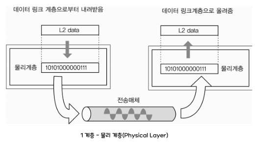
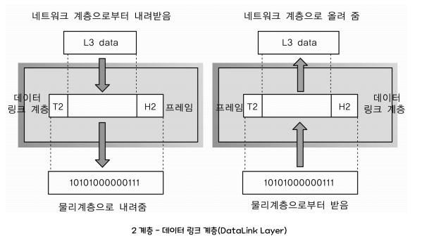
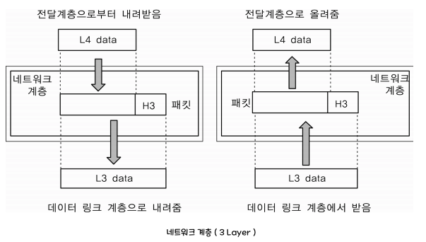
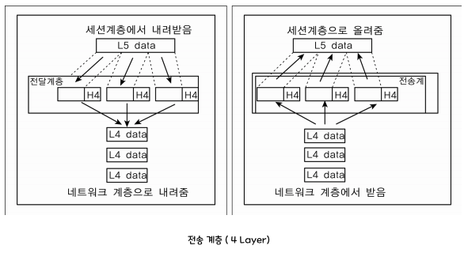
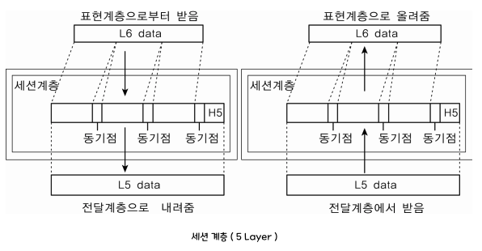
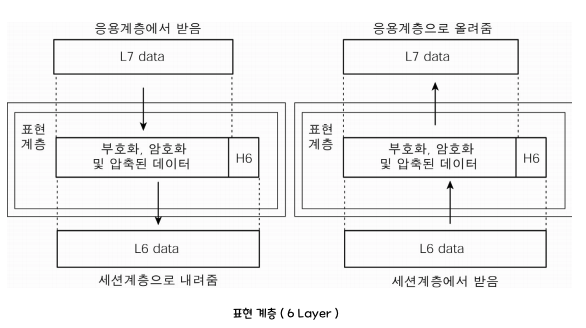
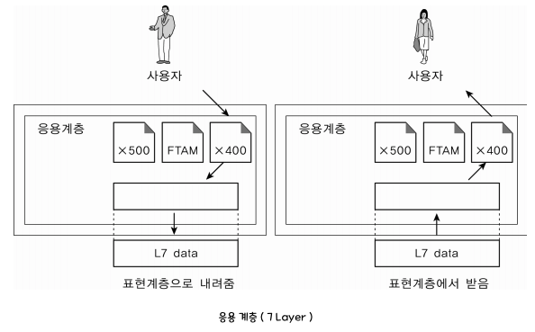

# 🌱 OSI 7계층이란?
 
- 네트워크 통신이 일어나는 과정을 7단계로 나눈 네트워크 표준 모델로 1984년 국제 표준화 기구(ISO)에서 정의하였다.
  - ISO (국제표준화기구, International Organization for Standardiztion)
- 컴퓨터 장치, 네트워킹 장치를 만들 때 OSI 참조모델이라고도 불리는 OSI 7계층을 기준으로 모든 통신장비를 제작하고 있다. (표준 모델 정의 전에는 통진장비 업체간 호환 불가)
- 표준 모델을 정의함으로써 각 계층을 모듈화 할 수 있었고 문제 발생시 원인파악이 용이해졌다.

## 🌱 캡슐화(encapsulation)와 비캡슐화(decapsulation)
`캡슐화`는 출발지(Source) 컴퓨터에서 데이터를 보낼때 계층을 내려가면서 목적지에 도달하게 하기 위해 자신의 계층에서 필요한 정보들을 `Header`에 계속 덧붙이는 과정이다.

> ### 캡슐화 예시 
> <b>[4] 전송 계층</b> 
> 데이터가 원하는 프로세스에 도착해야 하는데 여러개의 프로세스 중 어떤 프로세스에 도착해야하는지 정보가 필요하다. 즉 프로세스를 구분하는 Process Number 정보가 필요하고 이 Number를 포트(Port) 번호라고 한다. Transport 계층의 Header에는 포트번호가 추가된다. 
> <b>[3] 네트워크 계층</b> 
> 데이터가 목적지 호스트까지 찾아가기 위한 라우팅(routing) 과정에 목적지 주소가 필요하다. 네트워크 레이어에 해당하는 주소가 IP이므로 IP주소가 Header에 추가된다. 
> <b>[2] 데이터링크 계층</b> 
> 데이터를 인접한 시스템(노드)로 전송시켜야 하므로 Wifi를 사용한다면 Wifi모뎀의 MACwnth, Ethernet을 사용한다면 Ethernet LAN카드의 MAC주소가 Header에 추가된다. 

`역캡슐화`는 목적지에 도착한 데이터를 물리 계측부터 각각의 계층에서 데이터가 이상이 없는지 확인하고 하나씩 header를 제거하면서 응용 계층으로 올려보내는 과정이다.

> ### 역캡슐화 예시 
> `[2]데이터링크 계층` 에서는 wifi 모뎀주소를 확인하고 header제거 
> `[3]네트워크 계층` 에서는 IP주소를 확인하고 header제거 
> `[4]전송 계층` 에서는 Port번호를 확인하고 header제거 
> 결국 목적지의 Application에는 원본 데이터만 전달되게 된다.

##  🌱 제 1계층 - 물리계층(Physical Layer)
 
> 최하위 계층에 속하며 상위계층(데이터 링크)에서 전송된 데이터를 물리적인 전송매체 (허브, 라우터, 케이블 등)를 통해 다른 시스템에 전기적 신호를 전송하는 역할

- 0과 1로 구성된 bit열의 데이터를 전기/무선/광 신호로 변환해서 주고받는 기능만 수행
- 데이터를 전송하는 물리적인 장비 (통신케이블, 허브 등)
- 데이터가 무엇인지, 어떠한 에러가 있는지 신경쓰지 않음
- 전송단위(PDU) : bit
- 프로토콜 : 모뎀, RS-232, ...

##  🌱 제 2계층 - 데이터 링크 계층(DataLink Layer)
 
> 물리적인 네트워크 기기들 사이의 데이터를 전송하는 전송로 역할을 담당한다. 즉, 라우터들 사이의 네트워크 링크에서 데이터 전송이 잘 이뤄지도록 관리. 이 계층에서는 비트를 프레임(Frame)이라는 논리적 단위로 구성한다. 

- 물리 계층을 통해 송수신되는 데이터의 전송 오류를 감지하고 재전송한다.
- 프레임에 물리적 주소(MAC address)를 부여하고 에러검출, 재전송, 흐름제어 수행
- 장비 : 브릿지, 스위치, 이더넷 등
- 전송단위(PDU) : Frame
- 프로토콜 : MAC, LAN, ...

##  🌱 제 3계층 - 네트워크 계층(Network Layer)
 
> 라우팅 알고리즘을 사용하여 최적의 경로를 선택하고 데이터가 목적지까지 가장 안전하고 빠르게 전달하는 기능을 담당한다. 데이터링크 계층이 노드-노드 전달을 감독한다면, 네트워크 계층은 각 패킷이 목적지까지 성공적이요 효과적으로 전달되도록 한다.

- 목적지 네트워크 주소(IP)를 정하고 그에 따른 경로선택, 경로에 따라 패킷 전달
- 여러개의 노드(node)를 거칠 때마다 경로를 찾아주는 역할을 하는 계층
- 장비 : 라우터, L3tmdnlcl
- 전송단위(PDU) : Frame
- 프로토콜 : IP, ICMP, ...
  
##  🌱 제 4계층 - 전송 계층(Transport Layer)
 
> 발신지에서 목적지(End to End)간 제어와 에러를 관리한다. 패킷의 전송이 유효한지 확인하고 전송에 실패된 패킷을 다시 보내는 것과 같은 신뢰성있는 통신을 보장하며, 헤드에는 세그먼트(Segment)가 포함된다. 주소설정, 오류 및 흐름제어, 다중화를 수행한다.

- EndPoint의 사용자들이 신뢰성 있는 데이터를 주고받게 해주는 역할
  - 오류 검출 및 복구, 흐름제어, 중복검사 등을 수행
- 패킷 생성 및 전송
  - 패킷들의 전송이 유효한지 확인하고 전송 실패한 패킷들을 재전송
- 헤더에는 포트 번호가 포함
- 전송단위(PDU) : 세그먼트(Segment)
- 장비 : 게이트웨이(GateWay), L4스위치
- 프로토콜 : `TCP`, `UDP`, ARP, RTP

##  🌱 제 5계층 - 세션 계층(Session Layer)
 
> 통신 세션을 구성하는 계층으로, 포트(Port) 번호를 기반으로 연결한다.통신 장치 간의 상호 작용을 설정하고 유지하며 동기화한다. 동시 송수신(Duplex), 반이중(Half-Duplex),전이중(Full-Duplex)  방식의 통신과 함께 체크 포인팅과 종료, 다시 시작 과정 등을 수행한다.

- Session : 클라이언트와 웹 서버간 네트워크 연결이 지속 유지되고 있는 상태
  - 사용자가 브라우저를 열어 서버에 접속한 뒤 접속을 종료할 시점까지를 의미
- 네트워크 상 양쪽 연결을 관리하고 연결을 지속시켜주는 계층
- 전송단위(PDU) : DATA
- 프로토콜 : NetBIO, SSH, TLS
1. 세션 설정 : 통신을 시작하기 위해 양측 간 세션을 설정한다.
2. 세션 유지 : 데이터를 주고받는 동안에는 세션이 유지되어야한다. 
   - 동기화 : 통신 당사자 간의 데이터 교환을 동기화하여 데이터의 일관성을 유지
   - 대화제어 : 데이터 전송의 순서를 조정하고 필요에 따라 데이터 전송 일시중지, 재개하는 등의 작업을 수행한다.
3. 세션 종료 : 통신이 완료되면 양측에 통신 종료를 알리고 세션을 안전하게 종료한다. 
   - 동시 송수신 방식 : 양쪽 장치가 동시에 데이터를 주고받을 수 있는 방식. 전이중 방식을 사용하며 네트워크에서 가장 일반적으로 사용되는 방식 중 하나이다.
   - 반이중방식 : 양쪽 장치가 번갈아가며 데이터를 주고받을 수 있느 방식. 한 번에 하나의 방향으로만 통신이 이뤄지며, 순서대로 데이터를 주고받는다.
   - 전이중방식 : 양쪽 장치가 동시에 데이터를 주고받을 수 있는 방식. 각각의 방향으로 별도의 통신 채널을 사용하므로 동시에 양방향으로 통신이 이뤄진다.

##  🌱 제 6계층 - 표현 계층(Presentation Layer)
 
>송신 측과 수신 측 사이에서 데이터의 형식(png, jpg 등)을 정해준다. 받은 데이터를 코드 변환, 구문 검색, 인코딩 - 디코딩 및 암호화, 압축의 과정을 통해 올바른 표준 방식으로 변환해준다.

- 응용 계층(7 Layer)으로부터 전달받거나 전송하는 데이터의 인코딩 - 디코딩 및 암호화 등이 이루어지는 계층
- 코드 간의 번역을 담당하여 데이터의 형식상 차이를 다루는 부담을 응용 계층(7 Layer)으로부터 덜어준다.
- 전송하는 데이터의 표현방식을 결정한다.
- 전송단위(PDU) : DATA
- 프로토콜(Protocol) : JPG, MPEG, SMB, AFP

##  🌱 제 7계층 - 응용 계층(Application Layer)
 
> 사용자와 바로 연결되어 있으며 응용 SW를 도와주는 계층이다. 사용자로부터 정보를 입력받아 하위 계층으로 전달하고 하위 계층에서 전송한 데이터를 사용자에게 전달한다. 파일 전송, DB, 메일 전송 등 여러 가지 응용 서비스를 네트워크에 연결해주는 역할을 한다.

- 응용 프로세스와 직접 관계하여 일반적인 응용 서비스를 네트워크에 연결 및 수행하는 역할
- 사용자와 직접 접하는 유일한 계층
  - 사용자로부터 정보를 입력받아 하위 계층으로 전달하고, 하위 계층에서 전송한 데이터를 사용자에게 전달
  - UI 부분, I/O부분
- 프로토콜 : HTTP, DNS, Telnet, FTP 등
