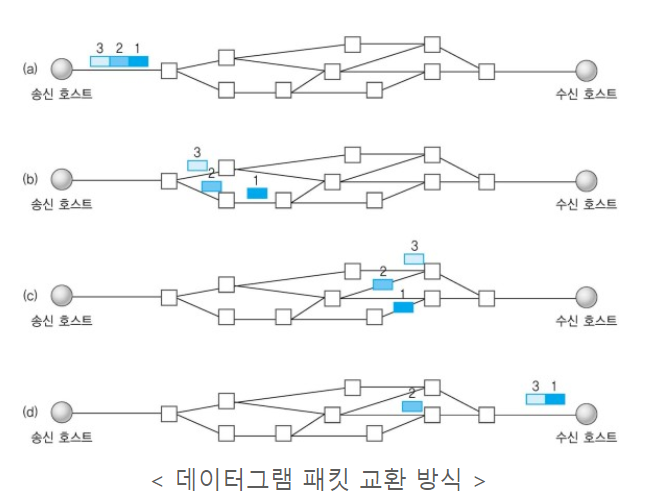

## 🌱 TCP

 

- Transmission Control Protocol의 약자로 `전송을 제어하는 규약`이라는 뜻이다.
- TCP/IP에서 TCP는 `패킷의 추적 및 관리`, IP는 `데이터의 배달`을 처리한다.
  - 패킷이란? 인터넷 내에서 데이터 전송을 위한 라우팅을 효율적으로 하기 위해 나눠진 조각들
  - 라우팅이란? 메세지에서 목적지까지 갈 수 있는 여러 경로 중 한가지 경로를 설정해주는 과정
- 통신 연결이 유지되는 것을 지향하는 연결 지향적 프로토콜이다. 통신할 장치끼리 "수신했다", "송신했다"와 같은 확인 메세지와 함께 데이터를 주고받으면서 통신의 신뢰성을 높인다.

> 특징

- 데이터의 경계를 구분하지 않는 바이트 스트림 서비스 (byte-stream service)
  - 1바이트 단위로 데이터를 입출력 하며 데이터간의 구분을 의미적으로 구분하지 않고 단순히 바이트들의 연속적인 흐름으로 본다. 
  - 이는 데이터 흐름제어(수신자 버퍼 오버플로우), 혼잡제어 (패킷수가 과도하게 증가) 등을 신경쓰지 않도록 한다.
- 높은 신뢰성 보장
  - 속도는 UDP보다 느리지만 신뢰성이 높은 전송을 한다.
- 전이중(Full-Duplex), 점대점(Point to Point) 방식
  - 전이중 (Full-Duplex) : 전송이 양방향으로 동시에 일어날 수 있다.
  - 점대점 (Point to Point) : 각 연결이 정확히 2개의 종단점을 가지고 있다. 
- 연결형 서비스로 가상 회선 방식을 제공한다. (3way/4way handshaking)
    - 네트워크 지연등의 문제로 클라이언트와 서버 사이의 통신 상태가 불안정 할경우 서로의 수신을 확인하는 ACK패킷이 도착하지 않을때, 그들이 송신한 패킷이 손실되었다고 판단하고 재전송을 요청 할 수 있다.

> 단점
- 데이터로 보내기 전에 반드시 연결이 형성되어야함.
- 1 : 1 통신만 가능
- 고정된 통신 선로가 최단선(네트워크 길이)이 아닐경우 상대적으로 UDP보다 데이터 전송속도가 느림.

> 3-way handshaking

 
- 양쪽 모두 데이터를 전송할 준비가 되었다는 것을 보장하고, 실제로 데이터 전달을 시작하기 전에 한족이 다른쪽이 준비되었다는 것을 알 수 있도록 한다.
- 세변의 교환 과정은 네트워크 상황 변화, 지연등으로 인한 문제를 방지하기 위함이다.  

🌱 step 1 : SYN (동기화, Synchronize) 
클라이언트가 서버에 연결 요청을 하며 세션을 시작한다. 클라이언트는 SYN패킷(연결 확인을 보내는 무작위 숫자의 값)을 보내고 자신의 초기 시퀀스 번호(ISN)을 함께 전달한다.  
🌱 step 2 : SYN-ACK (Synchronize - Acknowledge) 
서버가 클라이언트의 요청을 받아들여 자신도 ISN값을 가진 SYN패킷과 ACK패킷(SYN에 1을 더한 값)을 함께 보낸다. 이는 클라이언트의 요청을 수락하고 자신도 연결을 시작하겠다는 의미.  
🌱 step 3 : ACK (숭인, Acknowledge) 
HandShake의 마지막 단계에서 클라이언트는 ACK플래그가 설정된 승인 패킷을 전송하여 서버의 SYN-ACK패킷에 응답한다. 이 패킷은 TCP연결 설정을 확인한다.

#### 포트(PORT) 상태 정보
- <b>CLOSED</b> : 포트가 닫힌 상태
- <b>LISTEN</b> : 포트가 열린 상태로 연결 요청 대기 중
- <b>SYN_RCV</b> : 요청을 받고 상대방의 응답을 기다리는 중
- <b>ESTABLISHED</b> : 포트 연결 상태

> 4-way handshaking

 
- TCP 연결 종료 과정에서 사용되는 기법
- 클라이언트와 서버 간에 세션을 종료하기 위한 핵심적인 방법으로, 연결의 안정성과 신뢰성을 보장한다.  

🌱 step 1 : FIN (Finish) 
클라이언트가 서버에 세션 종료 요청을 하며 FIN(Finish) 패킷을 보낸다. 이 단계에서 클라이언트는 더 이상 전달할 데이터가 없음을 서버에 알리게 된다.  
🌱 step 2 : ACK (Acknowledge) 
서버가 클라이언트의 요청을 받아들여 ACK(acknowledge) 패킷을 반환한다. 이 응답은 클라이언트가 보낸 FIN 패킷을 제대로 받았음을 클라이언트에게 알리는 역할을 한다.  
🌱 step 3 : FIN (Finish) 
서버 역시 클라이언트에게 세션 종료를 위한 FIN 패킷을 보낸다. 이 단계에서 서버는 더 이상 전달할 데이터가 없음을 클라이언트에 알린다.  
🌱 step 4 : ACK (Acknowledge) 
마지막으로 클라이언트가 서버에게 ACK 패킷을 보내면서 연결 종료 과정을 완료한다. 이 응답은 서버가 보낸 FIN 패킷을 제대로 받았음을 서버에게 알리는 의미이고 이제부터 더 이상의 데이터 교환은 발생하지 않는다.

연결 지향 프로토콜(TCP)은 전화통신과 같은 반면, 비연결 프로토콜(UDP)은 편지를 보내는 것과 같다. 친구에게 편지를 보낼 때, 각 친구마다 주소를 적는다. 우체국은 이런 편지 배송의 정보를 유지하지 않는다. 또한 편지가 도중에 분실되거나, 지연되거나, 배달 순서가 바뀌어 전달되지 않는 다는 보증을 하지 않는다.

## 🌱 UDP
- UDP(User Datagram Protocol)는 전송계층의 비연결 지향적 프로토콜로 데이터를 주고받을 때 연결 절차를 거치지 않고 발신자가 일방적으로 데이터를 발신하는 방식을 가진다.

> 특징
- 비연결형 서비스로 연결 없이 통신이 가능하며 데이터그램 방식을 제공한다.
  - 데이터그램 방식 : 연결을 위해 할당되는 논리적인 경로가 없고 각각의 패킷은 다른 경로로, 최적의 경로로 전송되며 독립적인 관계를 지닌다.
- 정보를 주고 받을때 정보를 보내거나 받는다는 신호절차를 거치지 않는다.
- 상대적으로 TCP보다 전송속도가 빠르다
- 데이터를 주고 받을때 정보를 보내거나 받는다는 신호절차를 거치지 않는다.
 

> 단점

- 데이터의 신뢰성이 없다.
- 의미있는 서버를 구축하기위해서는 일일이 패킷을 관리해주어야 한다.
##  🌱  TCP / UDP 간략비교 

### 공통점

| **TCP와 UDP의 공통점**              |
| ----------------------------------- |
| 포트 번호를 이용하여 주소를 지정    |
| 데이터 오류 검사를 위한 체크섬 존재 |

 

### 차이점

|                    | **TCP**            | **UDP**                        |
| ------------------ | ------------------ | ------------------------------ |
| **연결방식**       | 연결형서비스       | 비 연결형 서비스               |
| **패킷 교환 방식** | 가상 회선 방식     | 데이터그램 방식                |
| **전송 순서**      | 전송 순서 보장     | 전송 순서가 바뀔 수 있음       |
| **수신 여부 확인** | 수신 여부를 확인함 | 수신 여부를 확인하지 않음      |
| **통신 방식**      | 1:1 통신만 가능    | 1:1 / 1:N / N:N 통신 모두 가능 |
| **신뢰성**         | 높음               | 낮음                           |
| **속도**           | 느림               | 빠름                           |

## ❓ 관련 질문
#### Q1. 만약 Server에서 FIN 플래그를 전송하기 전에 전송한 패킷이 Routing 지연이나 패킷 유실로 인한 재전송 등으로 인해 FIN 패킷보다 늦게 도착하는 상황이 발생하면 어떻게 될까?
A. 이러한 현상에 대비하여 Client는 Server로부터 FIN 플래그를 수신하더라도 
일정시간(Default: 240sec)동안 세션을 남겨 놓고 잉여 패킷을 기다리는 과정을 거친다. (TIME_WAIT 과정)

#### Q2. TCP의 연결 성립 과정과 연결 해제 과정의 단계수가 차이 나는 이유는?
A. Client가 데이터 전송을 마쳤다고 해도 Server는 아직 보낼 데이터가 남아있을 수 있기 때문에 
일단 FIN에 대한 ACK만 보내고, 데이터를 모두 전송한 후 자신도 FIN메세지를 보내기 때문이다.

#### Q3. 초기 Sequence Number인 ISN을 0부터 시작하지 않고 난수를 생성해서 설정하는 이유는?
A. Connection을 맺을 때 사용하는 포트(Port)는 유한 범위 내에서 사용하고 시간이 지남에 따라 재사용된다.
따라서 두 통신 호스트가 과거에 사용된 포트 번호 쌍을 사용하는 가능성이 존재한다.
Server측에서는 패킷의 SYN을 보고 패킷을 구분하게 되는데 난수가 아닌 순차적인 Number가 전송된다면
이전의 Connection으로부터 오는 패킷으로 인식할 수 있다. 이런 문제의 발생 가능성을 낮추기 위해 ISN을 난수로 설정한다.