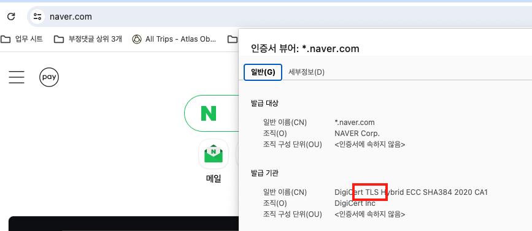
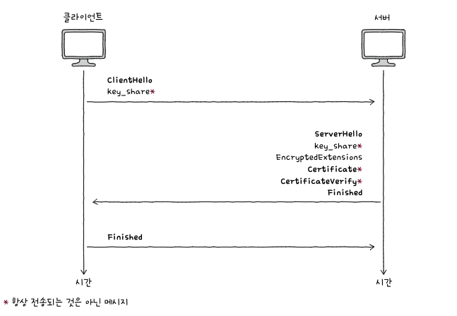

## 🚸 목차
1. 🌳 Https?
2. 🌳 TLS, SSL
3. 🌳 대칭 키 암호화, 공개 키 암호화
4. 🌳 TLS 핸드셰이크

## 🌳 Https?
- TCP/IP 구조의 통신은 전부 통신 경로 상에서 엿볼 수 있다. 
- http는 텍스트의 교환 즉, 평문교환이다.
- 누군가 중간에 해당 내용을 가로챈다면 아무런 보안장치 없이 해당 내용이 노출된다.
- 이를 방지하기 위해선 데이터를 주고받을때 이를 암호화하여 전송해야 한다.
- Http에 암호화와 인증을 더한 것이 바로 https다.

## 🌳 TLS, SSL
- TLS 프로토콜과 SSL 프로토콜 모두 https의 보안을 담당하는 프로토콜이다.
- TLS는 더 발전한 형태의 SSL이라고 보면 된다. 오늘날 주로 사용되는 프로토콜이다.
- 다만 SSL이 더 일반적으로 사용되었기에 아직까지 보안인증서는 SSL이라고 불린다.
</br>
실제로 https 웹사이트의 인증서를 보면 tls 인증서 발급기관에서 발급된 것을 알 수 있다.

## 🌳 대칭 키 암호화, 비대칭 키 암호화
> 주고 받는 데이터를 암호화하고 복호화 하는 방법에는 대칭키 암호화와 비대칭키 암호화 두가지 방식이 존재한다.

### 대칭 키 암호화
- 암호화와 복호화에 동일한 키를 사용한다. 시간이 빠르다.
- 암호화에 사용한 키로만 복호화를 할 수 있기 때문에 대칭키라는 이름이 붙었다.
- 이는 다른 말로 하면 키가 유출되었을 때 지금까지의 암호화가 모두 무용지물이 될 수 있다.
- 상대방에게 안전하게 키를 전달할 수 있다면?
    - 그 방식으로 메세지를 주고받으면 될것이다.

### 비대칭 키 암호화 (공개 키 암호화)
- 암호화와 복호화에 서로 다른 키를 사용하게 되고 그 한쌍의 키를 공개키, 개인키라고 부른다.
- 암호화에 공개키를 사용하고 복호화에 개인키를 사용하게 된다.
- 서로 키가 다르기 때문에 하나의 키로는 다른 키를 유추 할 수 없다.
- 공개키는 이름처럼 누구에게나 공개되어도 큰 문제가 되지 않는다.
- 단, 개인키 만큼은 보안에 신경써야 할 것이다.

### 세션키
- 대칭키 암호화 방식과 비대칭 키 암호화방식의 혼합형태
- 대칭키를 안전하게 전달하기 위해 공개키로 대칭키를 암호화 하고 개인키로 암호화된 대칭키를 복호화한다.
- 하나의 키를 사용한 암호문이 많을 경우 이를 분석하여 키를 계산할 가능성이 있기 때문에 이를 방지하기 위한 임시 키
- 하나의 통신 세션 동안에만 사용한다.

---
#### 공개키 인증서
- 클라이언트와 웹 서버가 공개키 암호화 방식으로 통신할 때 웹서버로부터 전달받은 공개키가 신뢰할 수 있는지 생성자, 조작여부, 유효기간 등의 내용을 포함한 인증서
#### 인증기관 (CA)
- 해당 지증서를 발급, 검증, 저장하는 공인 기관
---
## 🌳 TLS 핸드셰이크
> 이 과정에서는 대칭키 방식과 공개키 방식 모두 사용한다. 핸드셰이크 과정은 공개키 방식, 이후의 통신은 대칭키 방식을 사용한다.

</br>
``` text
주요 과정
1. ClientHello
2. ServerHello
3. Certificate 메세지, CertificateVerify 메세지 전송
4. Finished
```
1. 암호화 통신을 위해 맞춰봐야할 정보를 제시하는 메세지이다.
    - 지원 TLS버전, 사용가능한 암호화 방식과 해시 함수 (암호 스위트), 난수 등
    ```
    0x13,0x01 - TLS_AES_128_GCM_SHA256 TLSv1.3 Kx=모든 Au=모든 Enc=AESGCM(128) Mac=AEAD
    0x13,0x02 - TLS_AES_256_GCM_SHA384 TLSv1.3 Kx=모든 Au=모든 Enc=AESGCM(256) Mac=AEAD
    0x13,0x03 - TLS_CHACHA20_POLY1305_SHA256 TLSv1.3 Kx=any Au=any Enc=CHACHA20/POLY1305(256) Mac=AEAD
    ```
2. 제시된 정보들 중 TLS버전, 암호 스위트등을 선택하여 클라이언트에 반환한다. 이렇게 결정된 정보를 토대로 암호화에 사용할 키를 만들어 낼 수 있다.
3. 인증서와 검증을 위한 디지털 서명
    - 이 메세지를 토대로 서버의 공개 키를 검증한다.
4. TLS 핸드셰이크의 마지막을 의미한다. 이렇게 얻어낸 키를 기반으로 암호화된 데이터를 주고받게 된다.

---

### 📢 같이 공부하면 좋을 면접 질문
- HTTPS에 대해서 설명하고 SSL(TLS) Handshake에 대해서 설명해보세요.
- 대칭키, 비대칭키 암호화 방식에 대해 설명해주세요.
- HTTP와 HTTPS의 차이를 설명해보고, HTTP를 사용하는 REST API 서버에게 HTTPS를 사용하게 하기 위해서는 어떠한 절차를 거쳐야 하는지 아는 대로 설명해보세요.

<br>

---


### 출처<br>
Mozilla [https://wiki.mozilla.org/Security/Server_Side_TLS]<br>
혼자서 공부하는 네트워크 p.394 - 405