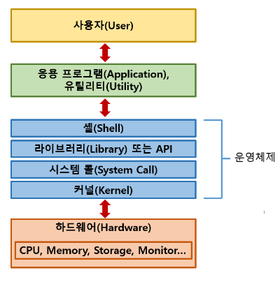

# 운영체제 (Operating System)

### 운영체제란?
- 컴퓨터 시스템의 하드웨어/소프트웨어 자원을 효율적으로 관리하여 사용자가 컴퓨터를 더 편리하고 효율적으로 사용할 수 있는 환경을 제공하는 시스템 소프트웨어다.
- 사용자와 하드웨어 간의 인터페이스로서 다른 응용프로그램이 유용한 작업을 할 수 있는 환경을 제공한다.

### 사용자 프로그램(Application)
- 사용자 프로그램은 특정 운영체제에 맞춰 만든다. 즉, windows에서수행 가능한 프로그램을 그대로 Linux에 옮기면 수행되지 않는다.
- 사용자 프로그램은 운영체제 위에서 작동하므로 하드웨어 자원을 직접 이용하지 않고 **운영체제가 제공하는 자원**만을 사용한다.

## 운영체제의 종류
- Windows, LINUX, UNIX, MS-DOS등이 존재한다.

## 동시 작업 가능 여부 분류
- 단일 작업 (single tasking) : 한번에 하나의 프로그램만 수행할 수 있다.
  - MS-DOS
- 다중 작업 (Multi tasking) : 한번에 여러 프로그램을 수행할 수 있다. 오늘날 대부분의 운영체제가 해당된다.
  - Window, UNIX, LINUX

## 사용자 수에 따른 분류
- 단일 사용자 (Single User)
  - MS-DOS
  - Windows
- 다중 사용자 (Multi User)
  - 서버
  - UNIX, NT Server

## 운영체제의 목적
운영체제의 성능을 평가하는 기준의 향상을 목표로 한다.
- 처리능력(ThroughPut) : 일정 시간 내에 시스템이 처리하는 일의 양
- 반환시간(Turn Around Time) : 시스템에 작업을 의뢰한 시간부터 처리가 완료될 떄까지 걸린 시간
- 사용가능도(Availability) : 시스템을 사용할 필요가 있을 때 즉시 사용 가능한 정도
- 신뢰도(Reliabilty) : 시스템이 주어진 문제를 정확하게 해결하는 정도

## 운영체제의 역할
- 자원의 관리 및 스케줄링
  - CPU소유권을 어떤 프로세스에 할당할까?
  - 프로세스의 생성과 삭제, 자원할당 및 반환 관리
  - FIFO, SJF(Shortest Job First), Round Robin Scheduling, Priority Scheduling 등
- 저장장치 관리
  - 한정된 메모리를 어떤 프로세스에 얼만큼 할당할까?
  - 가상 메모리
  - 파일의 생성, 수정, 제거, 공유, 복구 / 주기억장치와 보조기억장치간의 파일 전송 등 관리
- I/O 디바이스 관리
  - 입출력 장치와 컴퓨터간의 데이터 송수신 관리
  - 하드웨어의 종류가 많은 만큼 운영체제 내부의 디바이스 드라이버도 많이 존재한다.
  - 이러한 수많은 디바이스 드라이버들을 관리하는 기능 또한 운영체제가 담당한다.
- 네트워크 관리
  - 응용 프로그램이 네트워크를 사용하려면 운영체제에서 네트워크 프로토콜을 지원해야한다.
 
 ## 운영체제의 구조

- 커널(Kernel)
  - 하드웨어와 응용 프로그램 간의 상호작용 관리
  - 프로세스 관리, 메모리 관리, 입출력 관리, 파일시스템 관리 등..
  - 응용 프로그램이 파일 및 자원에 접근하려면 커널을 호출해야 하고, 커널이 해당 기능을 수행한 뒤 결과를 응용프로그램에 알려준다.
- 셸 (Shell)
  - 사용자와 운영체제 간의 인터페이스 역할을 한다. 즉, 사용자는 셸을 통해 운영체제와 상호작용하고 작업을 수행할 수 있다.
  - 여기서 인터페이스는 운영체제에게 정보,명령,신호등을 전달하기 위한 규칙을 의미한다.
  - Unix와 Linux의 Bash셸, Windows의 Command Prompt, PowerShell이 대표적이다.
- 시스템 콜 (System Call)
  - 응용프로그램이 운영체제의 기능을 사용할 수 있도록 하는 인터페이스
  - 응용프로그램이 운영체제의 커널에게 서비스를 요청하거나 하드웨어와 상호작용 하기 위해 사용된다. => 응용프로그램의 셸
 
## 운영체제 관련 용어
- 멀티테스킹
  - 하나의 프로그램이 끝나기 전에 다른 프로그램 시작 가능
- 멀티 프로그래밍
  - 메모리에 여러 프로그램이 동시에 올라가는 방식
- 시분할 시스템 (Time-Sharing)
  - 시간을 공유해서 사용한다. (CPU측면)
- 멀티 프로세싱
  - 여러 프로세스가 실행된다.
- 멀티코어
  - 하나의 컴퓨터에 CPU가 여러개 붙어있음을 의미한다.
 
## 컴퓨터의 요소

### CPU (Central Processing Unit)
산술논리연산장치, 제어장치, 레지스터로 구성되어 있는 장치. 인터럽트에 의해 단순히 메모리에 존재하는 명령어를 해석해서 실시

1. 산술논리연산장치(ALU, Arithmetic Logic Unit)
   - 덧셈, 뺄셈 같은 두 숫자의 산술 연산과 논리합, 논리곱 같은 논리 연산을 계산하는 디지털 회로
2. 제어장치(CU, Control Unit)
   - 프로세스 조작을 지시하는 CPU의 한 부품
   - 입출력장치 간 통신 제어, 명령어 읽고 해석, 데이터 처리 순서 결정
3. 레지스터
   - CPU안에 있는 임시기억장치 (CPU는 자체적으로 데이터를 저장할 방법이 없다)
   - CPU와 직접 연결되어 있어 연산 속도가 메모리보다 수십 ~ 수백 배 빠름
   - 데이터 저장 경로 : SSD or HDD → RAM → cache → register
>**Cpu의 연산 처리**
>   1. 제어장치가 메모리에 계산할 값을 로드.
>   2. 제어장치가 레지스터에 있는 값을 계산하라고 산술논리연산장치에 명령
>   3. 제어장치가 다시 레지스터에서 메모리로 계산된 값 저장

4. 메모리
 - 메모리는 전자회로에서 데이터나 상태, 명령어 등을 기록하는 장치. RAM이 이에 해당. CPU는 계산, 메모리는 기억을 담당.
