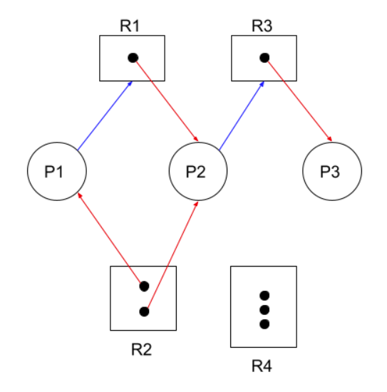

## 🚸 목차
1. 🌳 [교착상태란?](#🌳-교착상태란)
2. 🌳 [교착상태 예방법](#🌳-교착상태-예방법)
3. 🌳 [교착상태 회피법](#🌳-교착상태-회피법)
4. 🌳 [교착상태 검출 후 회복](#🌳-교착상태-검출-후-회복)  
 
## 🌳 교착상태란?
```
- 일어나지 않을 사건을 기다리며 진행이 멈춰버리는 현상
- 둘 이상의 프로세스/스레드가 이미 점유된 서로의 자원을 무한이 기다릴때 발생한다.
```

### 🌱 식사하는 철학자 문제
<br>

> 1. 일정 시간 생각을 한다.
> 2. 왼쪽 포크가 사용 가능해질 때까지 대기한다. 만약 사용 가능하다면 집어든다.
> 3. 오른쪽 포크가 사용 가능해질 때까지 대기한다. 만약 사용 가능하다면 집어든다.
> 4. 양쪽의 포크를 잡으면 일정 시간만큼 식사를 한다.
> 5. 오른쪽 포크를 내려놓는다.
> 6. 왼쪽 포크를 내려놓는다.
> 7. 다시 1번으로 돌아간다


### 🌱 자원 할당 그래프
<br>

- 프로세스는 원, 자원은 사각형, 사용할 수 있는 자원은 사각형 내 점으로 표현한다.
- <span style ="color:red">빨간색</span> 선은 자원을 할당했다는 의미이다.
  - (P1은 R2), (P2은 R1과 R2), (P3는 R3)의 자원을 할당받았다.
- <span style ="color:blue">파란색</span> 선은 자원의 할당을 기다리고 있다는 의미이다.
  - P1은 R1의 자원을 기다리고 있다. P2는 R3의 자원을 기다리고 있다.

#### <식사하는 철학자 문제를 자원할당 그래프로 표현한다면?>
 <br>
  ➡️ 교착상태에 있는 그래프는 <b><u>원의 형태</u></b> 를 띄고 있다.

### 🌱 교착상태 발생 조건
- 교착상태가 발생하는 조건에는 아래 4가지가 있다.
  
    #### ☑️ 상호배제
    - 교착상태가 발생하는 근본적인 원인은 하나의 자원을 한번에 하나의 프로세스만 이용 가능했기 때문이다.
    - 한 프로세스가 이용하고 있는 자원을 다른 프로세스가 이용하기 위해선 해당 자원이 해제될 때까지 기다려야한다.
    - 철학자들이 포크를 공유했다면?

    #### ☑️ 점유와 대기
    - 자원을 할당받은 상태에서 다른 자원 할당을 기다리는 상태
    - 철학자들 누구도 식사를 할 수 없었던 이유는?

    #### ☑️ 비선점
    - 이미 할당된 자원은 강제로 빼앗을 수 없다.
    - 마찬가지로 그 자원을 이용하는 프로세스의 작업이 끝나야만 해당 자원을 이용할 수 있다.
    - 만일 철학자들이 서로의 포크를 빼앗을 수 있었다면?

    #### ☑️ 원형 대기 (순환 대기)
    - 프로세스와 프로세스가 요청/할당한 자원들이 순환형태로 이루어져있다.
    - 원의 형태를 띄지 않는다면 교착상태는 발생하지 않지만 원의 형태라고 반드시 교착상태가 발생하는 것은 아니다.


## 🌳 교착상태 예방법
```
- 교착상태를 해결하는 방법에는 총 3가지가 있다.
- 교착상태를 예방하고, 회피하고, 교착상태를 검출 후 회복하는 방법이다.
```

🌱 상호 배제 삭제
- 상호배제를 없앤다는 말은 곧 모든 자원이 공유 가능해진다는 의미이다. (철학자들이 포크를 같이 쓰기 시작했다!)
- 하지만 현실적으로 모든 자원의 상호배제를 없애기에는 어려워 현실에 적용은 힘들다.
  - ex) 프로세스 A, B가 프린터기에 동시에 `동물 사진`과 `나무 사진` 프린트를 요청했다.

🌱 점유와 대기 삭제
- 철학자들에게 한 손에 포크를 들고 다른 포크를 기다리지 못하게 한다. ➡️ 포크 두개를 동시에 들거나, 아예 들지 않거나
- 이를 프로세스에 적용한다면 특정 프로세스에 자원을 모두 할당하거나 아예 할당하지 않는다.
- 교착상태를 해결하겠지만 자원의 활용률이 떨어진다.
  - 한 프로세스에 자원을 몰아주고 다른 프로세스는 대기한다.
  
🌱 비선점 조건 삭제
- 철학자들이 서로의 포크를 빼앗기 시작했다.
- 실제로 CPU는 프로세스들이 선점할 수 있는 대표 자원이다. 하지만 모든 자원이 선점 가능하진 않다.
- 하나의 프로세스가 프린터(자원)을 사용하다 중간에 다른 프로세스가 자원을 빼앗는다면 정상적인 작동이 어려울 수 있다. ➡️  범용성이 떨어진다.

🌱 원형 대기조건(순환 대기) 삭제
- 모든 자원에 번호를 할당하고 오름차순으로 자원을 할당하면 원형대기는 발생하지 않는다.
- 원형 식탁에 앉아있던 철학자들이 일렬 탁자에 앉게되었다.
- 앞의 방식들 중 비교적 현실적이고 실용적이지만 시스템 내 모든 자원에 번호를 할당하는 일은 간단하지 않은 작업이다.


## 🌳 교착상태 회피법
```
교착상태가 발생하지 않을 정도로만 자원을 할당하는 방식이다.
```
- 포크가 1,000개, 10,000개 있는 상황에선 철학자들이 밥을 못먹지 않을 것이다.
- 하지만 포크의 양이 충분하지 않은 상태에서 모든 철학자들이 자신이 필요한 양의 포크를 요청한다면 교착상태가 발생한다.
---
- 안전상태 : 교착상태가 발생하지 않고 모든 프로세스가 정상적으로 자원을 할당받고 종료될 수 있는 상태
- 불안전상태 : 교착상태가 발생할 수도 있는 상태
- 안전순서열 : 교착상태 없이 안전하게 프로세스들에 자원을 할당할 수 있는 순서
---


🌱 은행원 알고리즘
- 은행에서 모든 고객의 요구가 충족되도록 현금을 할당하는 데에서 유래
- 프로세스가 자원을 요구할 때, 시스템은 자원을 할당한 후에도 안정 상태로 남아있게 되는지 사전에 검사하여 교착 상태 회피
- 안정 상태면 자원 할당, 아니면 다른 프로세스들이 자원 해지까지 대기
  
> 총 할당 가능한 자원 12개<br>
> 프로세스 P1 ➡️  5개 자원 사용 중 (최대 10개)<br>
> 프로세스 P2 ➡️  2개 자원 사용 중 (최대 4개)<br>
> 프로세스 P3 ➡️  2개 자원 사용 중 (최대 9개)<br>
> 안전 순서열 : P2 ➡️ P1 ➡️ P3

### 이 상황에서 모든 프로세스가 최대 자원을 요청한다면??
|**프로세스**|**요구량**|**현재 사용량**|
|----------|--------|------------|
|   **P1**|    10   |       5    |
|   **P2**|     4   |       2    |
|   **P3**|     9   |       2    |
- 할당 가능한 자원 : 12
- 할당한 자원 : 9
- 남은 자원 : 3

안전 순서열에 따라 P2에게 먼저 자원을 할당한다.
|**프로세스**|**요구량**|**현재 사용량**|
|----------|--------|------------|
|   **P1**|    10   |       5    |
|   **P2**|     4   |     2+2    |
|   **P3**|     9   |       2    |
- 할당 가능한 자원 : 12
- 할당한 자원 : ~~9~~ ➡️ 11 
- 남은 자원 : ~~3~~ ➡️ 1

프로세스 P2가 작업을 완료하고 모든 자원을 반환하여 남은 자원은 5가 되었다.<br>
이제 순서열에 따라 P1에게 자원을 할당한다.

|**프로세스**|**요구량**|**현재 사용량**|
|----------|--------|------------|
|   **P1**|    10   |     5+5    |
|~~**P2**~~| ~~4~~  | ~~2+2~~    |
|   **P3**|     9   |       2    |
- 할당 가능한 자원 : 12
- 할당한 자원 : ~~7~~ ➡️ 12 
- 남은 자원 : ~~5~~ ➡️ 0

프로세스 P1이 작업을 완료하고 모든 자원을 반환하여 남은 자원은 10이 되었다.<br>
이제 순서열에 따라 P3에게 자원을 할당한다.

|**프로세스**|**요구량**|**현재 사용량**|
|----------|--------|------------|
|~~**P1**~~|  ~~10~~|  ~~5+5~~   |
|~~**P2**~~| ~~4~~  | ~~2+2~~    |
|   **P3**|     9   |     2+7    |
- 할당 가능한 자원 : 12
- 할당한 자원 : ~~2~~ ➡️ 7 
- 남은 자원 : ~~10~~ ➡️ 3

이처럼 <b>안전순서열</b>을 이용하여 모든 프로세스의 작업을 처리할 수 있었고 교착상태가 발생하지 않는 <b>안전상태</b>가 유지되었다. 그런데 만일 안전순서열 없이 작업이 진행되었다면 어떻게 될까??

설정된 안전 순서열이 없으니 운영체제는 P3에게 먼저 자원 1개를 할당하였다.

|**프로세스**|**요구량**|**현재 사용량**|
|----------|--------|------------|
|   **P1**|    10   |       5    |
|   **P2**|     4   |       2    |
|   **P3**|     9   |     2+1    |
- 할당 가능한 자원 : 12
- 할당한 자원 : ~~9~~ ➡️ 10
- 남은 자원 : ~~3~~ ➡️ 2

이제 P2의 작업을 수행하기 위해 P2에 남은 자원을 모두 할당한다.
|**프로세스**|**요구량**|**현재 사용량**|
|----------|--------|------------|
|   **P1**|    10   |       5    |
|   **P2**|     4   |     2+2    |
|   **P3**|     9   |     2+1    |
- 할당 가능한 자원 : 12
- 할당한 자원 : ~~10~~ ➡️ 12
- 남은 자원 : ~~2~~ ➡️ 0

프로세스 P2는 작업을 완료할 수 있겠지만 P2의 자원을 모두 반환받는다고 하더라도 남은 자원 4개로는 P1, P3 누구도 진행할 수 없는 상태가 되었다. P1과 P3 서로가 서로의 자원을 반환하기를 기다리는 <b>교착상태 (DeadLock)</b>이 발생했다.<br>
이렇듯 회피방식은 언제나 안전상태를 유지하도록 자원을 할당하는 방식이다.
#### 은행원 알고리즘의 단점
1. 최대 자원 요구량을 미리 알아야한다.
2. 프로세스들은 유한한 시간 안에 자원을 반납해야한다.
3. 교착상태가 일어나지 않을때 실행되므로 매번 알고리즘을 실행하면서 오버헤드가 발생한다.
4. 다중 프로그래밍 시스템에서는 사용자수가 항상 변한다.

## 🌳 교착상태 검출 후 회복
```
- 교착상태 발생을 인정하고 사후 조치 방식
- 프로세스들이 자원을 오규할때마다 교착상태 발생 여부를 주기적으로 검사하고, 교착상태가 검출 되면 회복을 진행한다.
```

🌱 선점을 통한 회복
- 교착상태가 해결될 때까지 다른 프로세스로부터 자원을 강제로 빼앗고 한 프로세스에 할당하는 방식
- 우선 순위가 낮은 프로세스나 수행 횟수 적은 프로세스 위주로 프로세스 자원 선점

🌱 프로세스 강제 종료를 통한 회복
- 교착상태에 놓인 프로세스들을 모두 강제종료하는 방식
  - 한 번에 교착상태를 해결할 수 있지만 프로세스들이 작업내역을 잃게 될 수 있다.
- 교착상태에 놓인 프로세스들을 하나씩 강제종료하는 방식
  - 종료할 때마다 교착상태 여부를 확인하는 작업을 진행해야 하므로 부담이 될 수 있다.


---
### 📢 같이 공부하면 좋을 면접 질문
1. 데드락이 무엇인가요?
2. 데드락 발생조건 4가지를 설명해 주세요.
3. 데드락의 해결방법에 대해서 설명해 주세요
4. 회피 기법인 은행원 알고리즘이 뭔지 설명해보세요.
