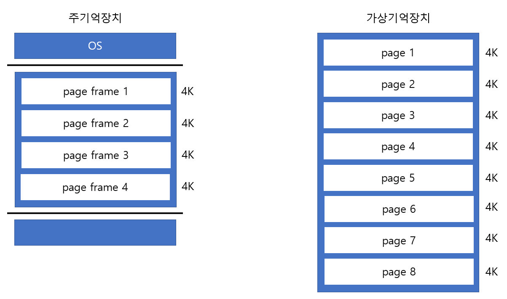
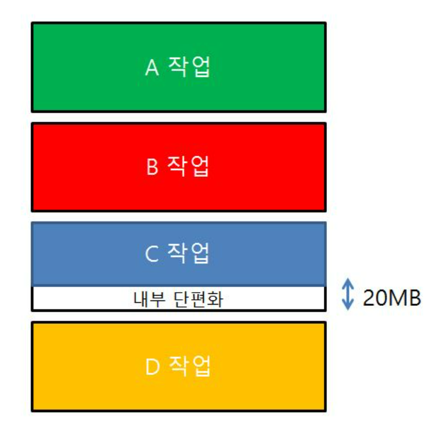
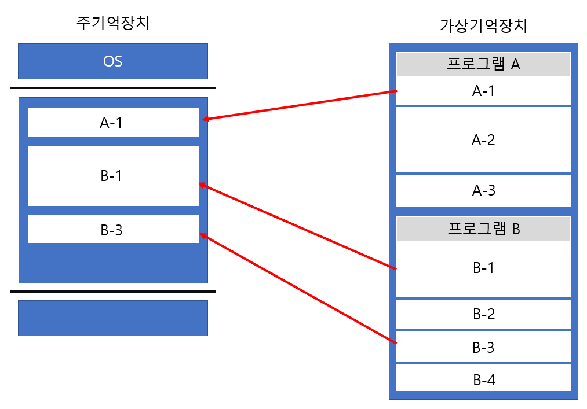
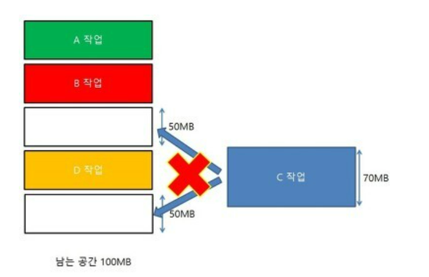
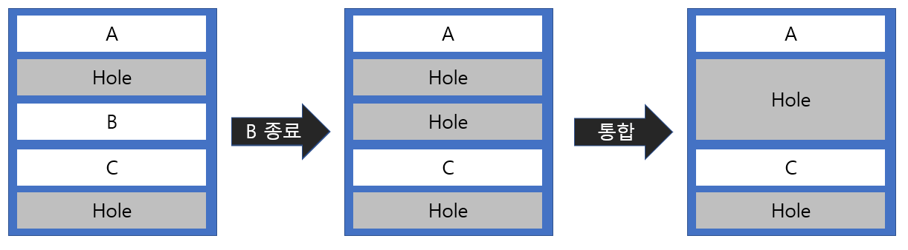
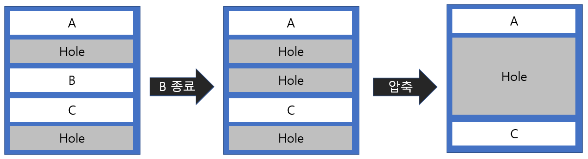

# 📃 페이징 기법과 세그먼트 기법

## 가상기억장치

> 주기억장치의 용량이 부족할 때 하드디스크의 일부 공간을 마치 주기억장치처럼 사용하는 기억장치

가상기억장치에 프로그램을 저장할 때는 불필요한 메모리 낭비를 줄이기 위해 프로그램을 여러 개의 블록 단위로 나눠 보관한다. 각각의 블록은 **mapping** 과정을 통해 주기억장치에 적재된다.   

주기억장치와 가상기억장치 간 프로세스를 무슨 단위로 load하고 store할지 정하는 방법에는 `페이징 기법`과 `세그먼테이션 기법`이 있다.

 

## 페이징 기법  

> 가상기억장치에 보관되어 있는 프로그램과 주기억장치의 영역을 동일한 크기로 나눈 후 나눠진 프로그램을 동잏라게 나눠진 주기억장치의 영역에 적재시켜 실행하는 기법

    
    
Page Pageframe

-  `Page` : 위 그림과 같이 가상기억장치의 블록을 **고정 크기**로 나누었을 때 그 블록
   - 프로그램 실행시 요구되는 블록만 주기억장치에 적재

- `Page frame` : 페이지 크기로 일정하게 나누어진 주기억장치의 단위

- 주소 변환을 위해서 페이지의 위치 정보를 가지고 있는 `페이지 맵 테이블(Page Map Table)`이 필요함
  - Page table은 Page의 번호, Page Frame의 시작주소 등이 저장되어 있음  
  - Page frame에 적재되는 Page가 교체되거나 Page fault가 발생할 때마다 Page Table은 갱신된다.    
  - Page의 크기가 작을수록 더 많은 주기억장치의 메모리가 낭비됨
  - 페이지 맵 테이블 사용으로 비용이 증가하고 처리 속도가 감소됨 

 

### 내부단편화
> 필요한 공간보다 더 큰 메모리가 할당되어 불필요하게 메모리가 낭비되는 현상

    
    
내부 단편화

ex) 프로그램의 크기가 30k이고, 각 page의 고정 크기가 4k라고 한다면 마지막 page의 실질적 크기는 2k가 될 것이다. 따라서 마지막 page가 주기억장치에 적재될 때 2k만큼의 **내부단편화**가 발생

- 페이지 크기를 작으면 내부 단편화가 감소가 되긴 하지만 이는 페이지 테이블 크기를 증가시킴
- 페이징에서는 내부 단편화를 해결할 방법이 없지만 내부 단편화는 외부 단편화에 비해 낭비되는 메모리 공간은 매우 적음

 

## 세그먼테이션 기법
> 가상기억장치에 보관되어 있는 프로그램을 다양한 크기의 논리적인 단위로 나눈 후 주기억장치에 적재시켜 실행하는 기법

- `Segment` : 프로그램을 배열이나 함수 등과 같은 논리적인 크기로 나눈 단위
- 세그먼테이션 기법을 이용하는 궁극적인 이유는 기억공간을 절약하기 위해서
- 주소 변환을 위해서 세그먼트가 존재하는 위치 정보를 가지고 있는 세그먼트 맵 테이블(Segment Map Table)이 필요
- 보호와 공유 기능을 수행할 수 있음
  - 프로그램의 중요한 부분과 중요하지 않은 부분을 분리하여 저장할 수 있고, 같은 코드 영역은 한번에 저장 가능

    
    
Segmentation

### 외부 단편화 
> 메모리가 할당되고 해제되는 작업이 반복되어, 메모리 공간 사이에 사용되지 않는 불연속적인 빈 공간이 존재하게 되는 상황

    
    
외부 단편화

#### 이를 해결하기 위해 `통합` 또는 `압축`을 할 수 있다.   
  
- `통합` : 빈 공간의 주소가 인접한 경우 하나로 합치는 방법
 

    
    
Coalescing

- `압축` : 프로세스의 재배치를 통해 모든 빈 공간을 하나로 합치는 방법이다. 
  

    
    
Compaction

   

#### Reference
[특수기억장치 및 기억장치의 분류](http://junhojohn.blogspot.com/2018/11/blog-post_12.html)   
[[Dev-Docs github]](https://github.com/im-d-team/Dev-Docs/blob/master/CS/%ED%8E%98%EC%9D%B4%EC%A7%95%EA%B3%BC%20%EC%84%B8%EA%B7%B8%EB%A8%BC%ED%85%8C%EC%9D%B4%EC%85%98.md)  
[[시나공 유튜브]](https://www.youtube.com/watch?v=Rzn1TFbzXYs)  
https://namoo-gamedev.tistory.com/28
